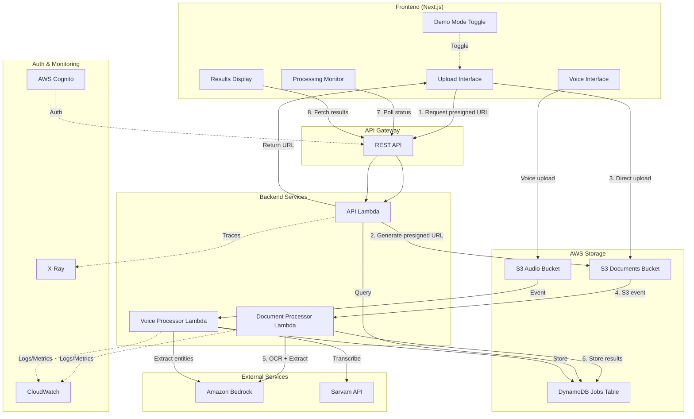
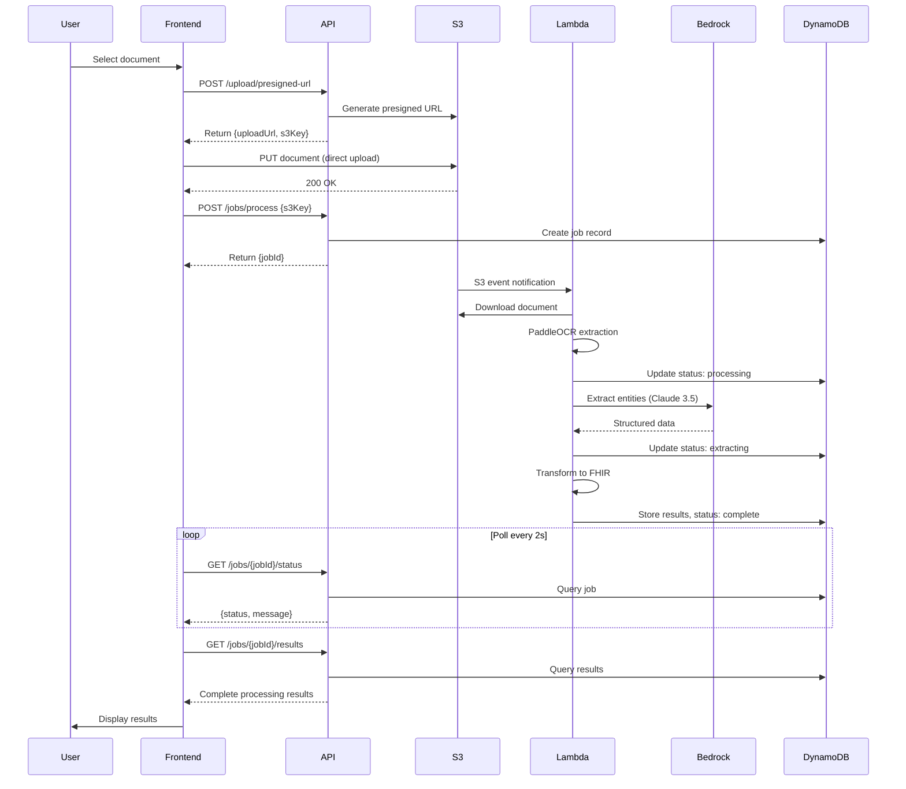
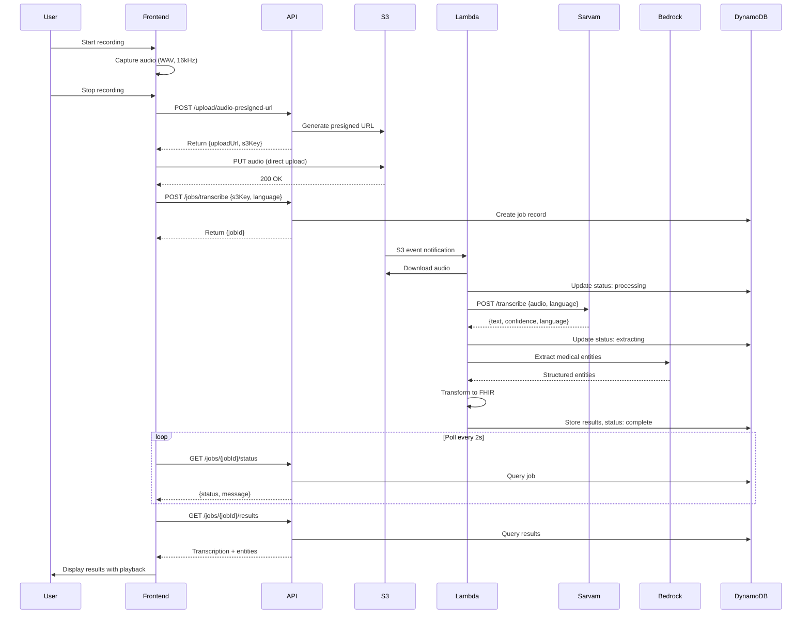

# Design Document: AWS Real Data Integration

## Overview

This design transforms the document-scan-demo application from a mock-data prototype to a production-ready system integrated with AWS services and Sarvam API for voice capabilities. The architecture maintains the existing frontend components while implementing a robust backend infrastructure for document processing, storage, and voice transcription.

### Key Design Goals

1. **Seamless Integration**: Replace mock data with real AWS services without changing the UI/UX
2. **Scalability**: Support concurrent document and voice processing with auto-scaling Lambda functions
3. **Security**: Implement presigned URLs for direct S3 uploads, avoiding backend bottlenecks
4. **Observability**: Comprehensive logging and metrics for monitoring and debugging
5. **Demo Mode**: Maintain mock data capability for offline demos and development
6. **Time-Constrained Implementation**: Design optimized for 5-hour implementation window

### Architecture Philosophy

The design follows a serverless-first approach using AWS Lambda for compute, S3 for storage, and DynamoDB for state management. Direct client-to-S3 uploads via presigned URLs minimize backend load and improve upload performance. Event-driven processing via S3 notifications ensures automatic document handling without polling overhead.

## Architecture

### High-Level System Architecture



### Document Processing Flow



### Voice Processing Flow



## Components and Interfaces

### Frontend Components

#### 1. API Client Enhancement (`frontend/lib/document-scan-demo/api-client.ts`)

**Purpose**: Extend existing API client with voice endpoints and improved error handling

**New Methods**:
```typescript
// Voice processing endpoints
export async function getAudioPresignedUrl(filename: string): Promise<PresignedUrlResponse>
export async function triggerTranscription(s3Key: string, language: string): Promise<{ jobId: string }>
export async function submitTranscriptionCorrection(jobId: string, correctedText: string): Promise<void>

// Enhanced upload with progress tracking
export async function uploadToS3(presignedUrl: string, file: File, onProgress: (progress: number) => void): Promise<void>
```

**Error Handling Strategy**:
- Network errors: Retry with exponential backoff (3 attempts)
- 401 Unauthorized: Redirect to login with session expired message
- 429 Rate Limit: Display user-friendly message with retry suggestion
- 500 Server Error: Log to console, display generic error message
- Timeout: 30-second timeout with descriptive error

#### 2. Voice Recording Component (`frontend/components/document-scan-demo/VoiceRecorder.tsx`)

**Purpose**: New component for audio capture and upload

**Props**:
```typescript
interface VoiceRecorderProps {
  onRecordingComplete: (jobId: string) => void;
  onError: (error: Error) => void;
  demoMode: boolean;
}
```

**State Management**:
```typescript
interface VoiceRecorderState {
  isRecording: boolean;
  recordingDuration: number;
  audioBlob: Blob | null;
  isUploading: boolean;
  uploadProgress: number;
  selectedLanguage: string;
}
```

**Audio Configuration**:
- Format: WAV
- Sample Rate: 16 kHz
- Channels: Mono
- Max Duration: 120 seconds (2 minutes)
- Browser API: MediaRecorder API

**Language Selection**:
- Dropdown with supported languages: Hindi, English, Tamil, Telugu, Kannada, Malayalam, Bengali, Marathi, Gujarati
- Default: Hindi
- Stored in localStorage for persistence

#### 3. Voice Results Component (`frontend/components/document-scan-demo/VoiceResults.tsx`)

**Purpose**: Display transcription results with editing capability

**Props**:
```typescript
interface VoiceResultsProps {
  results: VoiceProcessingResults;
  onEdit: (correctedText: string) => void;
  demoMode: boolean;
}
```

**Features**:
- Display transcribed text in editable textarea
- Show detected language and confidence score
- Warning indicator for confidence < 0.75
- Audio playback control
- Display extracted medical entities
- Show FHIR representation
- Submit corrections button

#### 4. Demo Mode Toggle Enhancement

**Current Implementation**: Basic toggle in header
**Enhancement**: Add visual indicator and notification toast

**State Persistence**:
```typescript
// Store in localStorage
const DEMO_MODE_KEY = 'document-scan-demo:demoMode';

function setDemoMode(enabled: boolean): void {
  localStorage.setItem(DEMO_MODE_KEY, JSON.stringify(enabled));
  // Trigger re-render of components
  window.dispatchEvent(new CustomEvent('demoModeChanged', { detail: { enabled } }));
}
```

### Backend Components

#### 1. API Lambda Function (`backend/api-handler/`)

**Purpose**: Handle all HTTP API requests with authentication and validation

**Technology Stack**:
- Runtime: Node.js 20.x
- Framework: Express.js (via serverless-http adapter)
- Validation: Joi schemas
- Authentication: AWS Cognito JWT verification

**Endpoints**:

```typescript
// Document upload
POST /upload/presigned-url
Request: { filename: string }
Response: { uploadUrl: string, s3Key: string, expiresIn: number }

// Audio upload
POST /upload/audio-presigned-url
Request: { filename: string }
Response: { uploadUrl: string, s3Key: string, expiresIn: number }

// Trigger document processing
POST /jobs/process
Request: { s3Key: string }
Response: { jobId: string }

// Trigger voice transcription
POST /jobs/transcribe
Request: { s3Key: string, language: string }
Response: { jobId: string }

// Get job status
GET /jobs/:jobId/status
Response: { jobId: string, status: ProcessingStage, message?: string, error?: string }

// Get processing results
GET /jobs/:jobId/results
Response: ProcessingResults | VoiceProcessingResults

// Submit transcription correction
PATCH /jobs/:jobId/transcription
Request: { correctedText: string }
Response: { success: boolean }
```

**Request Validation**:
```typescript
// Joi schemas for each endpoint
const presignedUrlSchema = Joi.object({
  filename: Joi.string().max(255).required()
    .pattern(/\.(jpg|jpeg|png|pdf)$/i)
});

const processJobSchema = Joi.object({
  s3Key: Joi.string().required()
});

const transcribeJobSchema = Joi.object({
  s3Key: Joi.string().required(),
  language: Joi.string().valid('hi', 'en', 'ta', 'te', 'kn', 'ml', 'bn', 'mr', 'gu').required()
});
```

**Authentication Middleware**:
```typescript
async function authenticateRequest(req: Request, res: Response, next: NextFunction) {
  const token = req.headers.authorization?.replace('Bearer ', '');

  if (!token) {
    return res.status(401).json({ error: 'Missing authentication token' });
  }

  try {
    // Verify JWT with Cognito public keys
    const decoded = await verifyToken(token);
    req.user = {
      userId: decoded.sub,
      email: decoded.email,
      username: decoded['cognito:username']
    };
    next();
  } catch (error) {
    return res.status(401).json({ error: 'Invalid or expired token' });
  }
}
```

**Rate Limiting**:
- Use existing rate-limit middleware from `backend/shared/nodejs/middleware/rate-limit.js`
- Configuration: 100 requests per minute per user
- Storage: DynamoDB (reuse existing rate limit table)

#### 2. Document Processor Lambda (`backend/document-processor/`)

**Purpose**: Process uploaded documents with OCR and entity extraction

**Technology Stack**:
- Runtime: Python 3.11
- OCR: PaddleOCR (existing implementation)
- AI: Amazon Bedrock (Claude 3.5 Sonnet)
- Image Processing: Pillow

**Trigger**: S3 event notification on document upload

**Processing Pipeline**:

```python
def lambda_handler(event, context):
    """
    Main handler for document processing
    """
    # 1. Extract S3 event details
    s3_event = event['Records'][0]['s3']
    bucket = s3_event['bucket']['name']
    key = s3_event['object']['key']

    # Extract jobId from S3 key pattern: uploads/{userId}/{jobId}-{filename}
    job_id = extract_job_id_from_key(key)

    # 2. Update job status to 'processing'
    update_job_status(job_id, 'processing', 'Processing document with OCR...')

    try:
        # 3. Download document from S3
        document_bytes = download_from_s3(bucket, key)

        # 4. Perform OCR extraction
        ocr_text = extract_text_with_paddle_ocr(document_bytes)

        # 5. Update status to 'extracting'
        update_job_status(job_id, 'extracting', 'Extracting medical entities...')

        # 6. Extract structured data with Bedrock
        structured_data = extract_entities_with_bedrock(ocr_text)

        # 7. Update status to 'transforming'
        update_job_status(job_id, 'transforming', 'Transforming to FHIR format...')

        # 8. Transform to FHIR resources
        fhir_bundle = transform_to_fhir(structured_data)

        # 9. Store complete results in DynamoDB
        store_results(job_id, {
            'ocrText': ocr_text,
            'entities': structured_data['entities'],
            'medications': structured_data['medications'],
            'conditions': structured_data['conditions'],
            'labResults': structured_data['labResults'],
            'fhirResource': fhir_bundle,
            'documentUrl': f"s3://{bucket}/{key}",
            'processedAt': datetime.utcnow().isoformat()
        })

        # 10. Update status to 'complete'
        update_job_status(job_id, 'complete', 'Processing complete')

    except Exception as e:
        logger.error(f"Processing failed for job {job_id}: {str(e)}", exc_info=True)
        update_job_status(job_id, 'failed', f'Processing failed: {str(e)}')
        raise
```

**Bedrock Prompt for Entity Extraction**:

```python
ENTITY_EXTRACTION_PROMPT = """
You are a medical document analysis assistant. Extract structured information from the following medical document text.

Document Text:
{ocr_text}

Extract the following information in JSON format:
1. entities: List of medical entities with text, type (MEDICATION, CONDITION, LAB_TEST, etc.), and confidence (0-1)
2. medications: List with name, dosage, frequency, and confidence
3. conditions: List of medical conditions
4. labResults: List with testName, value, unit, and confidence

Provide confidence scores based on text clarity and medical terminology accuracy.

Return only valid JSON without any markdown formatting.
"""
```

**Error Handling**:
- OCR failures: Retry once, then fail with descriptive error
- Bedrock throttling: Exponential backoff with 3 retries
- S3 download errors: Fail immediately with error message
- All errors logged to CloudWatch with full context

#### 3. Voice Processor Lambda (`backend/voice-processor/`)

**Purpose**: Transcribe audio and extract medical entities

**Technology Stack**:
- Runtime: Python 3.11
- HTTP Client: requests library
- AI: Amazon Bedrock (Claude 3.5 Sonnet)
- Audio: boto3 for S3 operations

**Trigger**: S3 event notification on audio upload

**Processing Pipeline**:

```python
def lambda_handler(event, context):
    """
    Main handler for voice transcription
    """
    # 1. Extract S3 event details
    s3_event = event['Records'][0]['s3']
    bucket = s3_event['bucket']['name']
    key = s3_event['object']['key']

    job_id = extract_job_id_from_key(key)

    # 2. Get job details (includes language selection)
    job = get_job(job_id)
    language = job['language']

    # 3. Update status to 'processing'
    update_job_status(job_id, 'processing', 'Transcribing audio...')

    try:
        # 4. Download audio from S3
        audio_bytes = download_from_s3(bucket, key)

        # 5. Call Sarvam API for transcription
        transcription_result = transcribe_with_sarvam(audio_bytes, language)

        # 6. Check confidence threshold
        confidence = transcription_result['confidence']
        needs_review = confidence < float(os.environ.get('CONFIDENCE_THRESHOLD', '0.75'))

        # 7. Update status to 'extracting'
        update_job_status(job_id, 'extracting', 'Extracting medical entities...')

        # 8. Extract medical entities with Bedrock
        entities = extract_entities_from_text(transcription_result['text'])

        # 9. Transform to FHIR
        fhir_bundle = transform_voice_to_fhir(transcription_result, entities)

        # 10. Store results
        store_results(job_id, {
            'transcribedText': transcription_result['text'],
            'detectedLanguage': transcription_result['language'],
            'confidence': confidence,
            'needsReview': needs_review,
            'entities': entities,
            'fhirResource': fhir_bundle,
            'audioUrl': f"s3://{bucket}/{key}",
            'processedAt': datetime.utcnow().isoformat()
        })

        # 11. Update status to 'complete'
        update_job_status(job_id, 'complete', 'Transcription complete')

    except Exception as e:
        logger.error(f"Transcription failed for job {job_id}: {str(e)}", exc_info=True)
        update_job_status(job_id, 'failed', f'Transcription failed: {str(e)}')
        raise
```

**Sarvam API Integration**:

```python
def transcribe_with_sarvam(audio_bytes: bytes, language: str) -> dict:
    """
    Call Sarvam API for audio transcription
    """
    # Get API key from Secrets Manager
    sarvam_api_key = get_secret('sarvam-api-key')

    # Prepare request
    url = os.environ['SARVAM_API_URL'] + '/transcribe'
    headers = {
        'Authorization': f'Bearer {sarvam_api_key}',
        'Content-Type': 'application/json'
    }

    # Convert audio to base64 for API
    audio_base64 = base64.b64encode(audio_bytes).decode('utf-8')

    payload = {
        'audio': audio_base64,
        'language': language,
        'format': 'wav',
        'sample_rate': 16000
    }

    # Call API with retry logic
    response = requests.post(url, json=payload, headers=headers, timeout=30)
    response.raise_for_status()

    result = response.json()

    return {
        'text': result['transcript'],
        'confidence': result['confidence'],
        'language': result['detected_language']
    }
```

**Secrets Management**:
- Sarvam API key stored in AWS Secrets Manager
- Retrieved once per Lambda cold start and cached
- Automatic rotation support via Secrets Manager

## Data Models

### DynamoDB Schema

**Table Name**: `document-scan-jobs`

**Primary Key**:
- Partition Key: `jobId` (String)

**Attributes**:
```typescript
interface JobRecord {
  jobId: string;                    // Primary key
  userId: string;                   // User who created the job
  type: 'document' | 'voice';       // Job type
  status: ProcessingStage;          // Current status
  message?: string;                 // Status message
  error?: string;                   // Error details if failed

  // Document-specific fields
  s3Key?: string;                   // S3 key for uploaded file
  documentUrl?: string;             // Full S3 URL
  ocrText?: string;                 // Extracted text

  // Voice-specific fields
  audioUrl?: string;                // S3 URL for audio
  language?: string;                // Selected language
  transcribedText?: string;         // Transcription result
  detectedLanguage?: string;        // Detected language
  confidence?: number;              // Transcription confidence
  needsReview?: boolean;            // Flag for low confidence

  // Common extracted data
  entities?: Entity[];              // Extracted entities
  medications?: Medication[];       // Extracted medications
  conditions?: string[];            // Medical conditions
  labResults?: LabResult[];         // Lab test results
  fhirResource?: object;            // FHIR bundle

  // Metadata
  createdAt: string;                // ISO timestamp
  updatedAt: string;                // ISO timestamp
  processedAt?: string;             // ISO timestamp
  ttl: number;                      // Unix timestamp for auto-deletion (90 days)
}
```

**Indexes**:
- GSI: `userId-createdAt-index` for querying user's jobs
  - Partition Key: `userId`
  - Sort Key: `createdAt`
  - Projection: ALL

**TTL Configuration**:
- Attribute: `ttl`
- Value: Unix timestamp (current time + 90 days)
- Automatic deletion by DynamoDB

### S3 Bucket Structure

**Documents Bucket**: `document-scan-documents-{env}`

```
uploads/
  {userId}/
    {jobId}-{filename}
```

**Audio Bucket**: `document-scan-audio-{env}`

```
uploads/
  {userId}/
    {jobId}-{filename}.wav
```

**Bucket Configuration**:
- Encryption: AWS KMS (default key)
- Versioning: Disabled
- Lifecycle Policy: Delete objects after 90 days
- CORS: Enabled for presigned URL uploads
- Event Notifications: Trigger Lambda on object creation

**CORS Configuration**:
```json
[
  {
    "AllowedHeaders": ["*"],
    "AllowedMethods": ["PUT", "POST"],
    "AllowedOrigins": ["https://yourdomain.com"],
    "ExposeHeaders": ["ETag"],
    "MaxAgeSeconds": 3000
  }
]
```

### TypeScript Type Extensions

**New Types** (`frontend/lib/document-scan-demo/types.ts`):

```typescript
// Voice processing types
export interface VoiceProcessingResults {
  jobId: string;
  audioUrl: string;
  transcribedText: string;
  detectedLanguage: string;
  confidence: number;
  needsReview: boolean;
  entities: Entity[];
  fhirResource: object;
  processedAt: string;
}

export interface AudioPresignedUrlResponse {
  uploadUrl: string;
  s3Key: string;
  expiresIn: number;
}

export type JobType = 'document' | 'voice';

// Extended job status response
export interface ExtendedJobStatusResponse extends JobStatusResponse {
  type: JobType;
  createdAt: string;
}

// Upload progress callback
export type UploadProgressCallback = (progress: number) => void;

// Language codes for Sarvam API
export type SupportedLanguage = 'hi' | 'en' | 'ta' | 'te' | 'kn' | 'ml' | 'bn' | 'mr' | 'gu';

export interface LanguageOption {
  code: SupportedLanguage;
  name: string;
  nativeName: string;
}

export const SUPPORTED_LANGUAGES: LanguageOption[] = [
  { code: 'hi', name: 'Hindi', nativeName: 'हिन्दी' },
  { code: 'en', name: 'English', nativeName: 'English' },
  { code: 'ta', name: 'Tamil', nativeName: 'தமிழ்' },
  { code: 'te', name: 'Telugu', nativeName: 'తెలుగు' },
  { code: 'kn', name: 'Kannada', nativeName: 'ಕನ್ನಡ' },
  { code: 'ml', name: 'Malayalam', nativeName: 'മലയാളം' },
  { code: 'bn', name: 'Bengali', nativeName: 'বাংলা' },
  { code: 'mr', name: 'Marathi', nativeName: 'मराठी' },
  { code: 'gu', name: 'Gujarati', nativeName: 'ગુજરાતી' }
];
```


## Correctness Properties

*A property is a characteristic or behavior that should hold true across all valid executions of a system-essentially, a formal statement about what the system should do. Properties serve as the bridge between human-readable specifications and machine-verifiable correctness guarantees.*

### Property 1: Presigned URL Expiration Consistency

*For any* filename requested for upload, the backend SHALL generate a presigned URL with exactly 3600 seconds expiration time.

**Validates: Requirements 1.2**

### Property 2: File Size Validation

*For any* file upload attempt, files under or equal to 10 MB SHALL be accepted and files over 10 MB SHALL be rejected with an appropriate error message.

**Validates: Requirements 1.6**

### Property 3: File Format Validation

*For any* file upload attempt, files with extensions .jpg, .jpeg, .png, or .pdf SHALL be accepted, and all other formats SHALL be rejected with an appropriate error message.

**Validates: Requirements 1.7**

### Property 4: Upload Error Handling

*For any* failed upload operation, the error handler SHALL display a descriptive error message to the user.

**Validates: Requirements 1.8**

### Property 5: Entity Confidence Scores

*For any* extracted entity from document processing, the entity SHALL have a confidence score between 0 and 1 (inclusive).

**Validates: Requirements 2.7**

### Property 6: Medication Structure Completeness

*For any* extracted medication, it SHALL contain name, dosage, and frequency fields.

**Validates: Requirements 2.4**

### Property 7: Lab Result Structure Completeness

*For any* extracted lab result, it SHALL contain testName, value, and unit fields.

**Validates: Requirements 2.5**

### Property 8: FHIR Transformation Validity

*For any* processed document or voice transcription, the generated FHIR resource SHALL be valid according to FHIR R4 specification with resourceType "Bundle" and type "collection".

**Validates: Requirements 2.8**

### Property 9: Job Storage and Retrieval

*For any* processing job, after storing results in DynamoDB with a jobId, querying with that jobId SHALL return the same results.

**Validates: Requirements 2.9, 5.13**

### Property 10: Processing Failure Status Update

*For any* processing job that encounters an error, the job status SHALL be updated to 'failed' with error details included.

**Validates: Requirements 2.10, 5.14**

### Property 11: Job ID Response

*For any* successful processing trigger request, the API SHALL return a response containing a jobId field.

**Validates: Requirements 3.1**

### Property 12: Processing Stage Display

*For any* job status value (uploading, processing, extracting, transforming, complete, failed), the Processing Monitor SHALL display the corresponding stage to the user.

**Validates: Requirements 3.3**

### Property 13: Polling Termination on Completion

*For any* job that reaches 'complete' status, the Processing Monitor SHALL stop polling for status updates.

**Validates: Requirements 3.4**

### Property 14: Polling Termination on Failure

*For any* job that reaches 'failed' status, the Processing Monitor SHALL stop polling and display the error message.

**Validates: Requirements 3.6**

### Property 15: Exponential Backoff Implementation

*For any* sequence of failed polling requests, the delay between retry attempts SHALL increase exponentially (e.g., 1s, 2s, 4s, 8s).

**Validates: Requirements 3.7**

### Property 16: Demo Mode Data Source

*For any* API request when demo mode is enabled, the API client SHALL return mock data instead of making real HTTP requests.

**Validates: Requirements 4.2**

### Property 17: Demo Mode Persistence

*For any* demo mode state change, the new state SHALL be persisted to browser localStorage and SHALL be retrievable after page reload.

**Validates: Requirements 4.4**

### Property 18: Demo Mode Notification

*For any* demo mode toggle action, a notification SHALL be displayed to the user indicating the mode change.

**Validates: Requirements 4.5**

### Property 19: Demo Mode Network Delay Simulation

*For any* API call in demo mode, the response SHALL be delayed by approximately 500ms, and uploads SHALL be delayed by approximately 2000ms.

**Validates: Requirements 4.6**

### Property 20: Audio Format Specification

*For any* captured audio recording, the audio SHALL be in WAV format with 16 kHz sampling rate.

**Validates: Requirements 5.2**

### Property 21: Recording Duration Limit

*For any* voice recording session, the recording SHALL automatically stop at or before 2 minutes (120 seconds).

**Validates: Requirements 5.4**

### Property 22: Language Support Validation

*For any* transcription request, the specified language SHALL be one of: Hindi (hi), English (en), Tamil (ta), Telugu (te), Kannada (kn), Malayalam (ml), Bengali (bn), Marathi (mr), or Gujarati (gu).

**Validates: Requirements 5.9**

### Property 23: Transcription Confidence Calculation

*For any* completed transcription, the result SHALL include a confidence score between 0 and 1.

**Validates: Requirements 5.10**

### Property 24: Low Confidence Flagging

*For any* transcription with confidence score below 0.75, the needsReview flag SHALL be set to true.

**Validates: Requirements 5.11**

### Property 25: Confidence Warning Display

*For any* transcription result with confidence below 0.75, the Results Display SHALL show a warning indicator.

**Validates: Requirements 6.4**

### Property 26: Error Logging

*For any* error that occurs in the application, the error SHALL be logged to the browser console with detailed context including error message, stack trace, and relevant request information.

**Validates: Requirements 7.9**

### Property 27: Retry Exponential Backoff

*For any* transient failure (network error, 429 rate limit), the retry logic SHALL implement exponential backoff with delays increasing by powers of 2.

**Validates: Requirements 7.10**

### Property 28: Authentication Header Inclusion

*For any* API request to the backend, the request SHALL include an Authorization header with the format "Bearer {token}".

**Validates: Requirements 8.1**

### Property 29: Invalid Token Rejection

*For any* API request with missing or invalid authentication token, the backend SHALL return HTTP status 401 Unauthorized.

**Validates: Requirements 8.2**

### Property 30: Token Expiration Extraction

*For any* valid JWT token, the backend SHALL correctly extract and verify the expiration timestamp from the token claims.

**Validates: Requirements 8.6**

### Property 31: User Identity Extraction

*For any* valid JWT token, the backend SHALL extract the user identity (userId, email, username) from the token claims.

**Validates: Requirements 8.7**

### Property 32: Consistent Error Response Format

*For any* error response from the backend, the response SHALL be in JSON format with consistent structure containing at minimum an "error" field.

**Validates: Requirements 9.8**

### Property 33: Request Validation

*For any* API request with invalid payload (missing required fields, wrong types, invalid values), the backend SHALL return HTTP status 400 Bad Request with validation error details.

**Validates: Requirements 9.9**

### Property 34: HTTP Status Code Correctness

*For any* API response, the HTTP status code SHALL correctly reflect the outcome: 200 for success, 400 for bad request, 401 for unauthorized, 404 for not found, 429 for rate limit, 500 for server error.

**Validates: Requirements 9.10**

### Property 35: Environment Variable Configuration

*For any* required configuration value (API URL, S3 bucket, DynamoDB table, etc.), the application SHALL read the value from the corresponding environment variable.

**Validates: Requirements 10.1, 10.2, 10.3, 10.4, 10.5, 10.7**

### Property 36: Confidence Threshold Default

*For any* deployment where CONFIDENCE_THRESHOLD environment variable is not set, the system SHALL use 0.75 as the default threshold value.

**Validates: Requirements 10.8**

### Property 37: Startup Environment Validation

*For any* backend service startup, if required environment variables are missing, the service SHALL fail to start and SHALL output a descriptive error message listing the missing variables.

**Validates: Requirements 10.9, 10.10**

### Property 38: Processing Event Logging

*For any* document or voice processing job, the system SHALL log events for processing start, completion, and failure to CloudWatch.

**Validates: Requirements 11.1, 11.2**

### Property 39: Job ID Log Correlation

*For any* log entry related to a processing job, the log entry SHALL include the jobId field for correlation.

**Validates: Requirements 11.8**

### Property 40: Confidence Score Logging

*For any* completed extraction (document or voice), the confidence scores SHALL be logged to CloudWatch for quality monitoring.

**Validates: Requirements 11.9**

### Property 41: Job Deletion Completeness

*For any* job deletion request, the system SHALL delete the S3 document/audio file AND the DynamoDB record atomically.

**Validates: Requirements 12.5**

### Property 42: Deletion Audit Logging

*For any* job deletion operation, the system SHALL log the deletion event with jobId, userId, and timestamp for audit trail.

**Validates: Requirements 12.6**

### Property 43: Recent Job Deletion Prevention

*For any* job deletion request where the job was created less than 24 hours ago, the system SHALL reject the deletion request with an appropriate error message.

**Validates: Requirements 12.7**

## Error Handling

### Frontend Error Handling Strategy

**Error Categories and Responses**:

1. **Network Errors** (ECONNABORTED, ERR_NETWORK)
   - User Message: "Unable to connect to server. Please check your connection."
   - Action: Retry with exponential backoff (3 attempts)
   - Logging: Log to console with request details

2. **Authentication Errors** (401)
   - User Message: "Session expired. Please log in again."
   - Action: Redirect to login page with reason parameter
   - Logging: Log session expiration event

3. **Authorization Errors** (403)
   - User Message: "You don't have permission to perform this action."
   - Action: Display error toast
   - Logging: Log authorization failure

4. **Validation Errors** (400)
   - User Message: Display specific validation error from backend
   - Action: Highlight invalid fields in UI
   - Logging: Log validation errors

5. **Rate Limiting** (429)
   - User Message: "Too many requests. Please wait a moment and try again."
   - Action: Exponential backoff, suggest retry after delay
   - Logging: Log rate limit hit

6. **Server Errors** (500, 502, 503, 504)
   - User Message: "Server error. Please try again later."
   - Action: Retry with exponential backoff (3 attempts)
   - Logging: Log server error with full response

7. **Timeout Errors**
   - User Message: "Request timed out. Please try again."
   - Action: Retry once, then fail
   - Logging: Log timeout with request duration

8. **File Validation Errors**
   - File too large: "File too large. Maximum size is 10 MB."
   - Invalid format: "Unsupported file format. Please upload JPEG, PNG, or PDF."
   - Action: Clear file input, allow user to select new file
   - Logging: Log validation failure

**Error Display Components**:

```typescript
// Toast notification for transient errors
interface ToastProps {
  message: string;
  type: 'error' | 'warning' | 'info' | 'success';
  duration?: number;
  onClose?: () => void;
}

// Error boundary for React component errors
class ErrorBoundary extends React.Component {
  componentDidCatch(error: Error, errorInfo: React.ErrorInfo) {
    console.error('Component error:', error, errorInfo);
    // Log to error tracking service (e.g., Sentry)
    // Display fallback UI
  }
}
```

### Backend Error Handling Strategy

**Lambda Error Handling**:

```python
class ProcessingError(Exception):
    """Base exception for processing errors"""
    pass

class OCRError(ProcessingError):
    """OCR extraction failed"""
    pass

class BedrockError(ProcessingError):
    """Bedrock API call failed"""
    pass

class SarvamError(ProcessingError):
    """Sarvam API call failed"""
    pass

def handle_processing_error(job_id: str, error: Exception):
    """
    Centralized error handling for processing jobs
    """
    error_message = str(error)
    error_type = type(error).__name__

    # Log error with full context
    logger.error(
        f"Processing failed for job {job_id}",
        extra={
            'jobId': job_id,
            'errorType': error_type,
            'errorMessage': error_message,
            'stackTrace': traceback.format_exc()
        }
    )

    # Update job status
    update_job_status(
        job_id,
        'failed',
        f'{error_type}: {error_message}'
    )

    # Emit CloudWatch metric
    emit_metric('ProcessingError', 1, {'ErrorType': error_type})
```

**API Error Responses**:

```typescript
interface ErrorResponse {
  error: string;           // Human-readable error message
  code: string;            // Machine-readable error code
  details?: object;        // Additional error details
  requestId?: string;      // Request ID for tracking
}

// Example error responses
{
  "error": "Invalid file format",
  "code": "INVALID_FILE_FORMAT",
  "details": {
    "allowedFormats": ["jpg", "jpeg", "png", "pdf"],
    "receivedFormat": "gif"
  },
  "requestId": "abc-123-def"
}
```

**Retry Logic**:

```typescript
async function retryWithBackoff<T>(
  fn: () => Promise<T>,
  maxRetries: number = 3,
  baseDelay: number = 1000
): Promise<T> {
  for (let attempt = 0; attempt < maxRetries; attempt++) {
    try {
      return await fn();
    } catch (error) {
      const isLastAttempt = attempt === maxRetries - 1;
      const isRetryable = isRetryableError(error);

      if (isLastAttempt || !isRetryable) {
        throw error;
      }

      const delay = baseDelay * Math.pow(2, attempt);
      await sleep(delay);
    }
  }
  throw new Error('Max retries exceeded');
}

function isRetryableError(error: any): boolean {
  // Network errors
  if (error.code === 'ECONNABORTED' || error.code === 'ERR_NETWORK') {
    return true;
  }

  // Rate limiting
  if (error.response?.status === 429) {
    return true;
  }

  // Server errors (but not client errors)
  if (error.response?.status >= 500) {
    return true;
  }

  return false;
}
```

### Circuit Breaker Pattern

For external service calls (Sarvam API, Bedrock), implement circuit breaker to prevent cascading failures:

```python
class CircuitBreaker:
    def __init__(self, failure_threshold: int = 5, timeout: int = 60):
        self.failure_threshold = failure_threshold
        self.timeout = timeout
        self.failure_count = 0
        self.last_failure_time = None
        self.state = 'CLOSED'  # CLOSED, OPEN, HALF_OPEN

    def call(self, func, *args, **kwargs):
        if self.state == 'OPEN':
            if time.time() - self.last_failure_time > self.timeout:
                self.state = 'HALF_OPEN'
            else:
                raise Exception('Circuit breaker is OPEN')

        try:
            result = func(*args, **kwargs)
            self.on_success()
            return result
        except Exception as e:
            self.on_failure()
            raise

    def on_success(self):
        self.failure_count = 0
        self.state = 'CLOSED'

    def on_failure(self):
        self.failure_count += 1
        self.last_failure_time = time.time()
        if self.failure_count >= self.failure_threshold:
            self.state = 'OPEN'
```

## Testing Strategy

### Dual Testing Approach

This feature requires both unit tests and property-based tests for comprehensive coverage:

**Unit Tests**: Focus on specific examples, edge cases, and integration points
- Specific error scenarios (file too large, invalid format)
- API endpoint responses with known inputs
- Component rendering with specific props
- Mock data generation accuracy

**Property-Based Tests**: Verify universal properties across all inputs
- File validation across random file sizes and formats
- Confidence score ranges for random extraction results
- Demo mode behavior with random user interactions
- Error handling with random error types

### Property-Based Testing Configuration

**Library Selection**:
- Frontend (TypeScript): `fast-check` library
- Backend (Python): `hypothesis` library

**Test Configuration**:
- Minimum 100 iterations per property test
- Each test tagged with feature name and property number
- Tag format: `Feature: aws-real-data-integration, Property {N}: {description}`

**Example Property Test** (Frontend):

```typescript
import fc from 'fast-check';

describe('Feature: aws-real-data-integration, Property 2: File Size Validation', () => {
  it('should accept files <= 10MB and reject files > 10MB', () => {
    fc.assert(
      fc.property(
        fc.integer({ min: 0, max: 20 * 1024 * 1024 }), // 0 to 20MB
        (fileSize) => {
          const file = createMockFile('test.jpg', fileSize);
          const result = validateFileSize(file);

          if (fileSize <= 10 * 1024 * 1024) {
            expect(result.valid).toBe(true);
          } else {
            expect(result.valid).toBe(false);
            expect(result.error).toContain('File too large');
          }
        }
      ),
      { numRuns: 100 }
    );
  });
});
```

**Example Property Test** (Backend):

```python
from hypothesis import given, strategies as st

# Feature: aws-real-data-integration, Property 5: Entity Confidence Scores
@given(st.text(min_size=10, max_size=1000))
def test_entity_confidence_scores(ocr_text):
    """All extracted entities should have confidence scores between 0 and 1"""
    entities = extract_entities(ocr_text)

    for entity in entities:
        assert 'confidence' in entity
        assert 0 <= entity['confidence'] <= 1
```

### Unit Test Coverage Requirements

**Frontend Components**:
- UploadInterface: File selection, validation, upload progress
- ProcessingMonitor: Polling logic, status display, timeout handling
- ResultsDisplay: Data rendering, FHIR display, entity formatting
- VoiceRecorder: Recording start/stop, duration limit, audio format
- VoiceResults: Transcription display, editing, playback control
- DemoModeToggle: State persistence, notification display

**Frontend Utilities**:
- API Client: Request formatting, error handling, retry logic
- Mock Data: Data generation, simulation timing
- Results Parser: Entity extraction, FHIR transformation

**Backend Services**:
- API Lambda: Endpoint routing, authentication, validation
- Document Processor: OCR extraction, Bedrock integration, FHIR transformation
- Voice Processor: Sarvam API integration, entity extraction, confidence calculation

**Integration Tests**:
- End-to-end document upload and processing flow
- End-to-end voice recording and transcription flow
- Demo mode toggle affecting all components
- Error scenarios across component boundaries

### Test Data Strategy

**Mock Data Requirements**:
- Sample medical documents (prescriptions, lab reports, discharge summaries)
- Sample audio files in multiple languages
- Various file sizes and formats for validation testing
- Edge cases: empty files, corrupted files, extremely large files

**Test Fixtures**:
```typescript
// frontend/test-fixtures/documents.ts
export const TEST_DOCUMENTS = {
  validPrescription: {
    filename: 'prescription.jpg',
    size: 2 * 1024 * 1024, // 2MB
    type: 'image/jpeg'
  },
  oversizedDocument: {
    filename: 'large.pdf',
    size: 15 * 1024 * 1024, // 15MB
    type: 'application/pdf'
  },
  invalidFormat: {
    filename: 'document.gif',
    size: 1 * 1024 * 1024,
    type: 'image/gif'
  }
};
```

### Continuous Integration

**Test Execution**:
- Run all unit tests on every commit
- Run property-based tests on every pull request
- Run integration tests before deployment
- Generate coverage reports (target: 80% coverage)

**Performance Benchmarks**:
- Frontend bundle size: < 500KB gzipped
- API response time: < 200ms (p95)
- Document processing time: < 30 seconds (p95)
- Voice transcription time: < 15 seconds (p95)


## Infrastructure and Deployment

### AWS Service Configuration

#### S3 Buckets

**Documents Bucket** (`document-scan-documents-{env}`):

```yaml
Properties:
  BucketName: document-scan-documents-${env}
  VersioningConfiguration:
    Status: Disabled
  BucketEncryption:
    ServerSideEncryptionConfiguration:
      - ServerSideEncryptionByDefault:
          SSEAlgorithm: aws:kms
          KMSMasterKeyID: alias/aws/s3
  LifecycleConfiguration:
    Rules:
      - Id: DeleteOldDocuments
        Status: Enabled
        ExpirationInDays: 90
  CorsConfiguration:
    CorsRules:
      - AllowedHeaders: ['*']
        AllowedMethods: [PUT, POST]
        AllowedOrigins: ['https://yourdomain.com']
        ExposedHeaders: [ETag]
        MaxAge: 3000
  NotificationConfiguration:
    LambdaConfigurations:
      - Event: s3:ObjectCreated:*
        Function: !GetAtt DocumentProcessorFunction.Arn
        Filter:
          S3Key:
            Rules:
              - Name: prefix
                Value: uploads/
```

**Audio Bucket** (`document-scan-audio-{env}`):

```yaml
Properties:
  BucketName: document-scan-audio-${env}
  # Same configuration as documents bucket
  NotificationConfiguration:
    LambdaConfigurations:
      - Event: s3:ObjectCreated:*
        Function: !GetAtt VoiceProcessorFunction.Arn
        Filter:
          S3Key:
            Rules:
              - Name: prefix
                Value: uploads/
```

#### DynamoDB Table

**Jobs Table** (`document-scan-jobs-{env}`):

```yaml
Properties:
  TableName: document-scan-jobs-${env}
  BillingMode: PAY_PER_REQUEST  # On-demand pricing
  AttributeDefinitions:
    - AttributeName: jobId
      AttributeType: S
    - AttributeName: userId
      AttributeType: S
    - AttributeName: createdAt
      AttributeType: S
  KeySchema:
    - AttributeName: jobId
      KeyType: HASH
  GlobalSecondaryIndexes:
    - IndexName: userId-createdAt-index
      KeySchema:
        - AttributeName: userId
          KeyType: HASH
        - AttributeName: createdAt
          KeyType: RANGE
      Projection:
        ProjectionType: ALL
  TimeToLiveSpecification:
    AttributeName: ttl
    Enabled: true
  StreamSpecification:
    StreamViewType: NEW_AND_OLD_IMAGES
  PointInTimeRecoverySpecification:
    PointInTimeRecoveryEnabled: true
```

#### Lambda Functions

**API Lambda**:

```yaml
ApiFunction:
  Type: AWS::Serverless::Function
  Properties:
    FunctionName: document-scan-api-${env}
    Runtime: nodejs20.x
    Handler: index.handler
    CodeUri: ./backend/api-handler
    MemorySize: 512
    Timeout: 30
    Environment:
      Variables:
        S3_DOCUMENTS_BUCKET: !Ref DocumentsBucket
        S3_AUDIO_BUCKET: !Ref AudioBucket
        JOBS_TABLE: !Ref JobsTable
        COGNITO_USER_POOL_ID: !Ref UserPool
        RATE_LIMIT_TABLE: !Ref RateLimitTable
    Policies:
      - S3CrudPolicy:
          BucketName: !Ref DocumentsBucket
      - S3CrudPolicy:
          BucketName: !Ref AudioBucket
      - DynamoDBCrudPolicy:
          TableName: !Ref JobsTable
      - DynamoDBCrudPolicy:
          TableName: !Ref RateLimitTable
    Events:
      ApiGateway:
        Type: Api
        Properties:
          Path: /{proxy+}
          Method: ANY
          Auth:
            Authorizer: CognitoAuthorizer
```

**Document Processor Lambda**:

```yaml
DocumentProcessorFunction:
  Type: AWS::Serverless::Function
  Properties:
    FunctionName: document-scan-processor-${env}
    Runtime: python3.11
    Handler: handler.lambda_handler
    CodeUri: ./backend/document-processor
    MemorySize: 3008  # Maximum for CPU-intensive OCR
    Timeout: 300      # 5 minutes
    EphemeralStorage:
      Size: 2048      # 2GB for large documents
    Environment:
      Variables:
        JOBS_TABLE: !Ref JobsTable
        BEDROCK_MODEL_ID: anthropic.claude-3-5-sonnet-20241022-v2:0
        CONFIDENCE_THRESHOLD: '0.75'
    Policies:
      - S3ReadPolicy:
          BucketName: !Ref DocumentsBucket
      - DynamoDBCrudPolicy:
          TableName: !Ref JobsTable
      - Statement:
          - Effect: Allow
            Action:
              - bedrock:InvokeModel
            Resource: '*'
      - CloudWatchPutMetricPolicy: {}
    Layers:
      - !Ref PaddleOCRLayer
      - !Ref PillowLayer
```

**Voice Processor Lambda**:

```yaml
VoiceProcessorFunction:
  Type: AWS::Serverless::Function
  Properties:
    FunctionName: document-scan-voice-processor-${env}
    Runtime: python3.11
    Handler: handler.lambda_handler
    CodeUri: ./backend/voice-processor
    MemorySize: 1024
    Timeout: 120      # 2 minutes
    Environment:
      Variables:
        JOBS_TABLE: !Ref JobsTable
        SARVAM_API_URL: https://api.sarvam.ai/v1
        SARVAM_API_KEY_SECRET: !Ref SarvamApiKeySecret
        BEDROCK_MODEL_ID: anthropic.claude-3-5-sonnet-20241022-v2:0
        CONFIDENCE_THRESHOLD: '0.75'
    Policies:
      - S3ReadPolicy:
          BucketName: !Ref AudioBucket
      - DynamoDBCrudPolicy:
          TableName: !Ref JobsTable
      - Statement:
          - Effect: Allow
            Action:
              - bedrock:InvokeModel
            Resource: '*'
          - Effect: Allow
            Action:
              - secretsmanager:GetSecretValue
            Resource: !Ref SarvamApiKeySecret
      - CloudWatchPutMetricPolicy: {}
```

#### Secrets Manager

**Sarvam API Key**:

```yaml
SarvamApiKeySecret:
  Type: AWS::SecretsManager::Secret
  Properties:
    Name: document-scan/sarvam-api-key-${env}
    Description: Sarvam API key for voice transcription
    SecretString: !Sub |
      {
        "apiKey": "${SarvamApiKey}"
      }
```

#### CloudWatch Alarms

```yaml
ProcessingErrorAlarm:
  Type: AWS::CloudWatch::Alarm
  Properties:
    AlarmName: document-scan-processing-errors-${env}
    AlarmDescription: Alert when processing error rate exceeds threshold
    MetricName: ProcessingError
    Namespace: DocumentScan
    Statistic: Sum
    Period: 300
    EvaluationPeriods: 1
    Threshold: 10
    ComparisonOperator: GreaterThanThreshold
    TreatMissingData: notBreaching

ApiLatencyAlarm:
  Type: AWS::CloudWatch::Alarm
  Properties:
    AlarmName: document-scan-api-latency-${env}
    AlarmDescription: Alert when API latency exceeds threshold
    MetricName: Duration
    Namespace: AWS/Lambda
    Dimensions:
      - Name: FunctionName
        Value: !Ref ApiFunction
    Statistic: Average
    Period: 60
    EvaluationPeriods: 2
    Threshold: 1000  # 1 second
    ComparisonOperator: GreaterThanThreshold
```

### Environment Configuration

**Development Environment** (`.env.development`):

```bash
# Frontend
NEXT_PUBLIC_API_URL=https://api-dev.yourdomain.com
NEXT_PUBLIC_DEMO_MODE=true
NEXT_PUBLIC_AWS_REGION=us-east-1
NEXT_PUBLIC_COGNITO_USER_POOL_ID=us-east-1_xxxxx
NEXT_PUBLIC_COGNITO_CLIENT_ID=xxxxx

# Backend (Lambda environment variables set via SAM template)
S3_DOCUMENTS_BUCKET=document-scan-documents-dev
S3_AUDIO_BUCKET=document-scan-audio-dev
JOBS_TABLE=document-scan-jobs-dev
SARVAM_API_URL=https://api.sarvam.ai/v1
CONFIDENCE_THRESHOLD=0.75
```

**Production Environment** (`.env.production`):

```bash
# Frontend
NEXT_PUBLIC_API_URL=https://api.yourdomain.com
NEXT_PUBLIC_DEMO_MODE=false
NEXT_PUBLIC_AWS_REGION=us-east-1
NEXT_PUBLIC_COGNITO_USER_POOL_ID=us-east-1_yyyyy
NEXT_PUBLIC_COGNITO_CLIENT_ID=yyyyy

# Backend
S3_DOCUMENTS_BUCKET=document-scan-documents-prod
S3_AUDIO_BUCKET=document-scan-audio-prod
JOBS_TABLE=document-scan-jobs-prod
SARVAM_API_URL=https://api.sarvam.ai/v1
CONFIDENCE_THRESHOLD=0.75
```

### Deployment Strategy

**Infrastructure as Code**:
- Use AWS SAM (Serverless Application Model) for Lambda and API Gateway
- Use CloudFormation for S3, DynamoDB, and other resources
- Store templates in `infrastructure/` directory

**Deployment Pipeline**:

1. **Build Phase**:
   - Install dependencies (npm, pip)
   - Run linters (ESLint, Pylint)
   - Run unit tests
   - Build frontend (Next.js)
   - Package Lambda functions

2. **Test Phase**:
   - Run property-based tests
   - Run integration tests against dev environment
   - Generate coverage reports

3. **Deploy Phase**:
   - Deploy infrastructure changes (CloudFormation)
   - Deploy Lambda functions (SAM)
   - Deploy frontend (Vercel/Amplify)
   - Run smoke tests

4. **Verification Phase**:
   - Health check endpoints
   - Verify CloudWatch metrics
   - Test demo mode functionality

**Rollback Strategy**:
- CloudFormation stack rollback on failure
- Lambda function versioning with aliases
- Frontend deployment rollback via Vercel/Amplify
- Database schema migrations with rollback scripts

### Security Considerations

**Authentication and Authorization**:
- AWS Cognito for user authentication
- JWT tokens with 1-hour expiration
- Automatic token refresh before expiration
- API Gateway Cognito authorizer for backend protection

**Data Encryption**:
- S3 server-side encryption with KMS
- DynamoDB encryption at rest (default)
- TLS 1.2+ for all API communication
- Secrets Manager for API keys

**Access Control**:
- IAM roles with least privilege principle
- S3 bucket policies preventing public access
- Lambda execution roles with minimal permissions
- VPC endpoints for private AWS service access (optional)

**Input Validation**:
- File size limits (10 MB)
- File type validation (JPEG, PNG, PDF, WAV)
- Request payload validation with JSON schemas
- SQL injection prevention (using DynamoDB, not SQL)
- XSS prevention (React auto-escaping)

**Rate Limiting**:
- API Gateway throttling: 1000 requests/second
- Per-user rate limiting: 100 requests/minute
- DynamoDB-based rate limit tracking
- Exponential backoff for retries

**Monitoring and Auditing**:
- CloudWatch Logs for all Lambda functions
- X-Ray tracing for request flow
- CloudTrail for API audit logs
- Deletion operations logged for compliance

### Cost Optimization

**Estimated Monthly Costs** (for 1000 active users):

- **S3 Storage**: $0.50 (assuming 20GB average)
- **S3 Requests**: $5.00 (upload/download operations)
- **Lambda Compute**: $50.00 (document + voice processing)
- **DynamoDB**: $10.00 (on-demand pricing)
- **API Gateway**: $3.50 (1M requests)
- **Bedrock**: $100.00 (Claude 3.5 Sonnet usage)
- **Sarvam API**: $50.00 (transcription usage)
- **CloudWatch**: $5.00 (logs and metrics)
- **Data Transfer**: $10.00 (outbound data)

**Total**: ~$234/month for 1000 users

**Cost Optimization Strategies**:
- Use S3 lifecycle policies for automatic deletion
- DynamoDB on-demand pricing (pay per request)
- Lambda memory optimization (right-sizing)
- CloudWatch Logs retention (7 days for dev, 30 days for prod)
- Bedrock batch processing for multiple documents
- Cache frequently accessed results in DynamoDB

### Monitoring and Observability

**Key Metrics to Track**:

1. **Performance Metrics**:
   - API response time (p50, p95, p99)
   - Document processing duration
   - Voice transcription duration
   - S3 upload time

2. **Business Metrics**:
   - Documents processed per day
   - Voice recordings transcribed per day
   - Success rate (complete vs failed)
   - Average confidence scores

3. **Error Metrics**:
   - Error rate by type (OCR, Bedrock, Sarvam)
   - 4xx vs 5xx error ratio
   - Timeout rate
   - Retry rate

4. **Resource Metrics**:
   - Lambda concurrent executions
   - DynamoDB consumed capacity
   - S3 storage usage
   - API Gateway throttling events

**CloudWatch Dashboard**:

```json
{
  "widgets": [
    {
      "type": "metric",
      "properties": {
        "metrics": [
          ["DocumentScan", "ProcessingDuration", {"stat": "Average"}],
          [".", ".", {"stat": "p95"}]
        ],
        "period": 300,
        "stat": "Average",
        "region": "us-east-1",
        "title": "Processing Duration"
      }
    },
    {
      "type": "metric",
      "properties": {
        "metrics": [
          ["DocumentScan", "ProcessingError", {"stat": "Sum"}],
          [".", "ProcessingSuccess", {"stat": "Sum"}]
        ],
        "period": 300,
        "stat": "Sum",
        "region": "us-east-1",
        "title": "Processing Success vs Errors"
      }
    }
  ]
}
```

### Implementation Timeline (5 Hours)

**Hour 1: Infrastructure Setup**
- Create S3 buckets with lifecycle policies
- Create DynamoDB table with GSI and TTL
- Set up Lambda functions (skeleton)
- Configure S3 event notifications
- Store Sarvam API key in Secrets Manager

**Hour 2: Backend API Implementation**
- Implement presigned URL generation endpoints
- Implement job status and results endpoints
- Add authentication middleware
- Add request validation
- Add error handling

**Hour 3: Document and Voice Processing**
- Implement document processor Lambda
- Implement voice processor Lambda
- Integrate with Bedrock for entity extraction
- Integrate with Sarvam API for transcription
- Add FHIR transformation logic

**Hour 4: Frontend Integration**
- Update API client with new endpoints
- Implement voice recorder component
- Implement voice results component
- Update demo mode toggle
- Add error handling and retry logic

**Hour 5: Testing and Deployment**
- Write critical unit tests
- Write property-based tests for validation
- Test end-to-end flows
- Deploy to development environment
- Verify functionality and fix issues

**Post-Implementation**:
- Add comprehensive test coverage
- Set up CloudWatch alarms
- Create monitoring dashboard
- Document API endpoints
- Conduct security review

## Summary

This design provides a comprehensive architecture for transforming the document-scan-demo from mock data to real AWS integration with Sarvam API voice capabilities. The key design decisions include:

1. **Presigned URLs**: Direct client-to-S3 uploads minimize backend load and improve performance
2. **Event-Driven Processing**: S3 notifications trigger Lambda functions automatically
3. **Serverless Architecture**: Lambda functions scale automatically with demand
4. **Demo Mode Preservation**: Existing mock data functionality maintained for offline demos
5. **Comprehensive Error Handling**: Retry logic, circuit breakers, and user-friendly error messages
6. **Property-Based Testing**: Universal properties verified across all inputs
7. **Security First**: Authentication, encryption, and input validation throughout
8. **Observability**: CloudWatch metrics, logs, and alarms for monitoring
9. **Cost Optimization**: On-demand pricing and automatic resource cleanup

The design is optimized for a 5-hour implementation window while maintaining production-ready quality standards. All components are designed to be testable, maintainable, and scalable.

