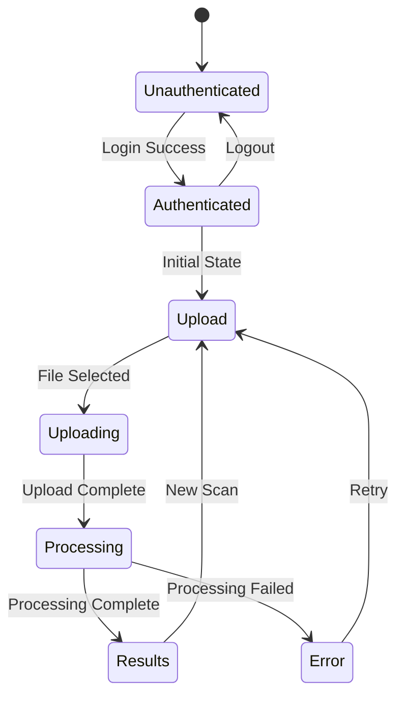

# Design Document: Document Scan Demo

## Overview

This design specifies a Next.js 14 frontend application that demonstrates a medical document scanning system. The application provides a streamlined workflow: authenticate → upload document → monitor processing → view results. The backend infrastructure (Lambda, API Gateway, S3, DynamoDB, Cognito) is already complete, so this design focuses exclusively on the frontend implementation.

The architecture prioritizes speed of implementation and demo readiness. We use Next.js 14 with App Router for modern React patterns, AWS Amplify for authentication, React Query for server state management, and Tailwind CSS for rapid styling. The application is designed to be deployed to Vercel with minimal configuration.

### Key Design Decisions

1. **Next.js 14 App Router**: Provides modern React Server Components, built-in routing, and excellent Vercel deployment
2. **AWS Amplify Auth**: Simplifies Cognito integration with minimal boilerplate
3. **React Query**: Handles polling, caching, and retry logic for API calls
4. **react-dropzone**: Battle-tested drag-and-drop file upload
5. **Axios**: Provides interceptors for auth headers and error handling
6. **Tailwind CSS**: Enables rapid UI development without custom CSS files

## Architecture

### Application Structure

```
document-scan-demo/
├── src/
│   ├── app/
│   │   ├── layout.tsx           # Root layout with Auth wrapper
│   │   ├── page.tsx              # Main workflow page
│   │   ├── login/
│   │   │   └── page.tsx          # Login page
│   │   └── results/
│   │       └── [jobId]/
│   │           └── page.tsx      # Results display page
│   ├── components/
│   │   ├── AuthWrapper.tsx       # Authentication guard
│   │   ├── UploadInterface.tsx   # File upload component
│   │   ├── ProcessingMonitor.tsx # Status polling component
│   │   ├── ResultsDisplay.tsx    # Results viewer
│   │   └── Header.tsx            # Navigation header
│   ├── lib/
│   │   ├── api-client.ts         # Axios instance with interceptors
│   │   ├── auth.ts               # Amplify auth configuration
│   │   ├── queries.ts            # React Query hooks
│   │   └── types.ts              # TypeScript interfaces
│   └── utils/
│       ├── results-parser.ts     # API response parsing
│       └── mock-data.ts          # Demo mode fallback data
├── public/
│   └── sample-documents/         # Sample images for demo
├── .env.example
├── next.config.js
├── tailwind.config.js
└── package.json
```

### Technology Stack

- **Framework**: Next.js 14.0+ (App Router)
- **Language**: TypeScript 5.0+
- **Authentication**: AWS Amplify 6.0+
- **HTTP Client**: Axios 1.6+
- **State Management**: @tanstack/react-query 5.0+
- **File Upload**: react-dropzone 14.0+
- **Styling**: Tailwind CSS 3.4+
- **Syntax Highlighting**: react-syntax-highlighter 15.5+
- **Deployment**: Vercel

### Workflow State Machine



## Components and Interfaces

### AuthWrapper Component

**Purpose**: Manages authentication state and protects routes

**Props**: None (wraps children)

**State**:
- `isAuthenticated: boolean` - Current auth status
- `user: CognitoUser | null` - Current user object
- `isLoading: boolean` - Auth check in progress

**Behavior**:
- On mount, checks for valid Cognito session
- If unauthenticated, redirects to `/login`
- Provides auth context to child components
- Handles token refresh automatically via Amplify

**Implementation Notes**:
- Uses Amplify `Auth.currentAuthenticatedUser()`
- Wraps app in `layout.tsx` for global protection
- Stores user info in React Context for access throughout app

### UploadInterface Component

**Purpose**: Handles file selection and upload to S3

**Props**:
- `onUploadComplete: (jobId: string) => void` - Callback when upload finishes

**State**:
- `selectedFile: File | null` - Currently selected file
- `previewUrl: string | null` - Image preview data URL
- `uploadProgress: number` - Upload percentage (0-100)
- `isUploading: boolean` - Upload in progress
- `error: string | null` - Error message if upload fails

**Behavior**:
1. User selects file via drag-and-drop or click
2. Validate file type (PNG, JPG, JPEG) and size (<10MB)
3. Display image preview
4. On submit, request pre-signed URL from API
5. Upload file directly to S3 with progress tracking
6. Trigger backend processing job via API
7. Call `onUploadComplete` with job ID

**Implementation Notes**:
- Uses `react-dropzone` for file selection
- Uses `FileReader` API for image preview
- Uses Axios for S3 upload with `onUploadProgress` callback
- Validates file type: `['image/png', 'image/jpeg', 'image/jpg']`
- Max file size: 10MB (10 * 1024 * 1024 bytes)

### ProcessingMonitor Component

**Purpose**: Polls API for job status and displays progress

**Props**:
- `jobId: string` - Processing job identifier
- `onComplete: (results: ProcessingResults) => void` - Callback when done

**State**:
- `status: ProcessingStage` - Current stage (uploading, processing, extracting, transforming, complete)
- `progress: number` - Estimated progress percentage
- `error: string | null` - Error message if processing fails
- `elapsedTime: number` - Seconds since processing started

**Behavior**:
1. Start polling API every 2 seconds
2. Update status and progress based on API response
3. Display visual progress indicator
4. If status is "complete", call `onComplete` with results
5. If status is "failed", display error message
6. If elapsed time exceeds 5 minutes, timeout with error

**Implementation Notes**:
- Uses React Query's `useQuery` with `refetchInterval: 2000`
- Maps backend status codes to display stages
- Calculates progress: uploading (0-20%), processing (20-50%), extracting (50-80%), transforming (80-95%), complete (100%)
- Uses `useEffect` to track elapsed time
- Automatically stops polling when status is terminal (complete/failed)

### ResultsDisplay Component

**Purpose**: Shows extracted data and FHIR resources

**Props**:
- `jobId: string` - Job identifier to fetch results

**State**:
- `results: ProcessingResults | null` - Complete results object
- `isLoading: boolean` - Fetching results
- `error: string | null` - Error if fetch fails
- `activeTab: 'overview' | 'ocr' | 'structured' | 'fhir'` - Current view

**Behavior**:
1. Fetch complete results from API on mount
2. Display original document image
3. Show tabbed interface for different result views:
   - Overview: Summary with key entities
   - OCR: Raw extracted text
   - Structured: Medications, conditions, observations with confidence scores
   - FHIR: Formatted JSON with syntax highlighting
4. Provide "New Scan" button to return to upload

**Implementation Notes**:
- Uses React Query's `useQuery` to fetch results
- Uses `react-syntax-highlighter` for FHIR JSON display
- Parses structured data using `results-parser.ts`
- Displays confidence scores as colored badges (>90% green, 70-90% yellow, <70% red)
- Groups medications, conditions, and observations into separate sections

### API Client

**Purpose**: Centralized HTTP client for backend communication

**Configuration**:
- Base URL from `process.env.NEXT_PUBLIC_API_URL`
- Timeout: 30 seconds
- Retry logic: 3 attempts with exponential backoff (1s, 2s, 4s)

**Interceptors**:
- **Request**: Adds `Authorization: Bearer <token>` header from Amplify
- **Response**: Handles 401 errors by redirecting to login
- **Error**: Implements retry logic with exponential backoff

**Methods**:
- `getPresignedUrl(filename: string): Promise<PresignedUrlResponse>`
- `triggerProcessing(s3Key: string): Promise<{ jobId: string }>`
- `getJobStatus(jobId: string): Promise<JobStatusResponse>`
- `getResults(jobId: string): Promise<ProcessingResults>`

**Implementation Notes**:
- Uses Axios instance with custom config
- Auth token retrieved via `Auth.currentSession().getIdToken().getJwtToken()`
- Retry logic uses `axios-retry` library
- All methods return typed promises for TypeScript safety

## Data Models

### TypeScript Interfaces

```typescript
// Authentication
interface CognitoUser {
  username: string;
  email: string;
  attributes: Record<string, string>;
}

// Upload
interface PresignedUrlResponse {
  uploadUrl: string;
  s3Key: string;
  expiresIn: number;
}

// Processing
type ProcessingStage =
  | 'uploading'
  | 'processing'
  | 'extracting'
  | 'transforming'
  | 'complete'
  | 'failed';

interface JobStatusResponse {
  jobId: string;
  status: ProcessingStage;
  message?: string;
  error?: string;
}

// Results
interface Entity {
  text: string;
  type: string;
  confidence: number;
}

interface Medication {
  name: string;
  dosage: string;
  frequency: string;
  confidence: number;
}

interface LabResult {
  testName: string;
  value: string;
  unit: string;
  confidence: number;
}

interface ProcessingResults {
  jobId: string;
  documentUrl: string;
  ocrText: string;
  entities: Entity[];
  medications: Medication[];
  conditions: string[];
  labResults: LabResult[];
  fhirResource: object;
  processedAt: string;
}

// Demo Mode
interface DemoConfig {
  enabled: boolean;
  uploadDelay: number;
  processingDuration: number;
}
```

### API Response Formats

The backend API returns responses in the following formats:

**Pre-signed URL Response**:
```json
{
  "uploadUrl": "https://s3.amazonaws.com/...",
  "s3Key": "uploads/user123/doc456.jpg",
  "expiresIn": 3600
}
```

**Job Status Response**:
```json
{
  "jobId": "job-abc-123",
  "status": "processing",
  "message": "Extracting text from document"
}
```

**Processing Results Response**:
```json
{
  "jobId": "job-abc-123",
  "documentUrl": "https://s3.amazonaws.com/...",
  "ocrText": "Patient Name: John Doe...",
  "entities": [
    { "text": "Amoxicillin", "type": "MEDICATION", "confidence": 0.95 }
  ],
  "medications": [
    {
      "name": "Amoxicillin",
      "dosage": "500mg",
      "frequency": "3 times daily",
      "confidence": 0.95
    }
  ],
  "conditions": ["Bacterial Infection"],
  "labResults": [
    {
      "testName": "Hemoglobin",
      "value": "14.2",
      "unit": "g/dL",
      "confidence": 0.92
    }
  ],
  "fhirResource": {
    "resourceType": "MedicationRequest",
    "status": "active",
    "medicationCodeableConcept": {
      "coding": [
        {
          "system": "http://www.nlm.nih.gov/research/umls/rxnorm",
          "code": "723",
          "display": "Amoxicillin"
        }
      ]
    }
  },
  "processedAt": "2024-01-15T10:30:00Z"
}
```


## Correctness Properties

*A property is a characteristic or behavior that should hold true across all valid executions of a system—essentially, a formal statement about what the system should do. Properties serve as the bridge between human-readable specifications and machine-verifiable correctness guarantees.*

### Property Reflection

After analyzing all acceptance criteria, I identified several areas of redundancy:

1. **Auth token inclusion**: Requirements 1.4 and 5.7 both specify that auth tokens must be in all requests - these can be combined into a single property
2. **Results display properties**: Requirements 4.2-4.6 all test that various parts of results are displayed - these can be combined into a comprehensive "results completeness" property
3. **Error message properties**: Requirements 6.1-6.6 all test specific error messages - while the messages differ, they follow the same pattern and can be tested with a single property about error handling
4. **API Client methods**: Requirements 5.1-5.4 test that specific API methods exist - these are examples, not properties, and can be verified with integration tests rather than property tests

The following properties represent the unique, non-redundant validation requirements:

### Property 1: Unauthenticated users are redirected

*For any* unauthenticated user state, attempting to access protected routes should result in redirection to the login page.

**Validates: Requirements 1.2**

### Property 2: Valid credentials result in token storage

*For any* valid authentication credentials, successful authentication should result in the token being stored and available for subsequent requests.

**Validates: Requirements 1.3**

### Property 3: All API requests include authentication

*For any* API request made through the API client, the request headers should include a valid authentication token.

**Validates: Requirements 1.4, 5.7**

### Property 4: Valid image formats are accepted

*For any* file with MIME type of image/png, image/jpeg, or image/jpg, the upload interface should accept the file for upload.

**Validates: Requirements 2.1**

### Property 5: File selection triggers preview

*For any* valid image file selected by the user, the upload interface should generate and display a preview of that image.

**Validates: Requirements 2.2**

### Property 6: Upload initiation requests pre-signed URL

*For any* upload initiation, the upload interface should make an API request to obtain a pre-signed S3 URL before uploading the file.

**Validates: Requirements 2.5**

### Property 7: Pre-signed URL triggers S3 upload

*For any* pre-signed URL received from the API, the upload interface should use that URL to upload the file directly to S3.

**Validates: Requirements 2.6**

### Property 8: Upload completion triggers processing

*For any* successful file upload to S3, the upload interface should trigger backend processing via the API.

**Validates: Requirements 2.7**

### Property 9: Upload progress is displayed

*For any* file upload in progress, the upload interface should display a progress percentage between 0 and 100.

**Validates: Requirements 2.8**

### Property 10: Upload completion starts polling

*For any* completed document upload, the processing monitor should begin polling the API for job status.

**Validates: Requirements 3.1**

### Property 11: Processing stage is displayed

*For any* job status response from the API, the processing monitor should display the current processing stage.

**Validates: Requirements 3.2**

### Property 12: In-progress jobs show progress indicator

*For any* job with status indicating processing is in progress, the processing monitor should display a visual progress indicator.

**Validates: Requirements 3.3**

### Property 13: Successful completion navigates to results

*For any* job that completes successfully, the processing monitor should navigate to the results display page.

**Validates: Requirements 3.4**

### Property 14: Failed processing displays error

*For any* job that fails processing, the processing monitor should display an error message containing the failure reason.

**Validates: Requirements 3.5**

### Property 15: Completion triggers results fetch

*For any* processing completion, the results display should fetch the complete results from the API.

**Validates: Requirements 4.1**

### Property 16: Results display is complete

*For any* processing results received, the results display should show all required components: original document image, OCR text, structured data (medications, conditions, observations), confidence scores, and FHIR resource JSON.

**Validates: Requirements 4.2, 4.3, 4.4, 4.5, 4.6**

### Property 17: Medication data includes required fields

*For any* medication in the structured data, the results display should show the medication name, dosage, and frequency.

**Validates: Requirements 4.8**

### Property 18: Lab result data includes required fields

*For any* lab result in the structured data, the results display should show the test name, value, and unit.

**Validates: Requirements 4.9**

### Property 19: Failed requests trigger retry with backoff

*For any* API request that fails, the API client should retry up to 3 times with exponential backoff (1s, 2s, 4s).

**Validates: Requirements 5.5**

### Property 20: Exhausted retries return descriptive error

*For any* API request where all 3 retries fail, the API client should return a descriptive error message.

**Validates: Requirements 5.6**

### Property 21: Upload failures display error message

*For any* file upload that fails, the upload interface should display an appropriate error message.

**Validates: Requirements 6.1**

### Property 22: Unsupported file types are rejected

*For any* file with a MIME type other than image/png, image/jpeg, or image/jpg, the upload interface should reject the file and display an error message.

**Validates: Requirements 6.2**

### Property 23: Oversized files are rejected

*For any* file larger than 10MB, the upload interface should reject the file and display an error message.

**Validates: Requirements 6.3**

### Property 24: Auth failures redirect to login

*For any* API request that returns a 401 authentication error, the auth wrapper should redirect to the login page with an appropriate message.

**Validates: Requirements 6.4**

### Property 25: Unreachable API displays connection error

*For any* API request that fails due to network unreachability, the API client should display a connection error message.

**Validates: Requirements 6.6**

### Property 26: Workflow step is displayed

*For any* application state, the UI should display the current step in the workflow (Upload, Processing, or Results).

**Validates: Requirements 7.3**

### Property 27: API calls show loading state

*For any* API call in progress, the application should display a loading state indicator.

**Validates: Requirements 7.6**

### Property 28: Demo mode uses mock responses

*For any* API request when demo mode is enabled, the application should use mock API responses instead of making real HTTP requests.

**Validates: Requirements 8.1**

### Property 29: OCR results are extracted

*For any* API response containing OCR results, the results parser should extract the text content.

**Validates: Requirements 10.1**

### Property 30: Structured data entities are extracted by type

*For any* API response containing structured data, the results parser should extract entities grouped by type (medications, conditions, observations).

**Validates: Requirements 10.2**

### Property 31: FHIR resources are parsed

*For any* API response containing a FHIR resource, the results parser should parse the JSON into a displayable format.

**Validates: Requirements 10.3**

### Property 32: Parser round-trip preserves data

*For any* valid API response, parsing the response, formatting it for display, and parsing again should produce an equivalent data structure.

**Validates: Requirements 10.4**

### Property 33: Malformed JSON returns error

*For any* API response containing malformed JSON, the results parser should return a descriptive error message rather than throwing an exception.

**Validates: Requirements 10.5**

## Error Handling

### Error Categories

1. **Authentication Errors**
   - Invalid credentials: Display error on login form
   - Expired session: Redirect to login with "Session expired" message
   - Missing token: Redirect to login

2. **Upload Errors**
   - Invalid file type: Display inline error, prevent upload
   - File too large: Display inline error, prevent upload
   - S3 upload failure: Display error with retry option
   - Pre-signed URL request failure: Display error with retry option

3. **Processing Errors**
   - Job not found: Display "Job not found" error
   - Processing timeout (>5 minutes): Display timeout error with retry option
   - Processing failure: Display error message from backend
   - Polling failure: Retry polling, display error after 3 failures

4. **Results Errors**
   - Results not found: Display "Results not available" error
   - Malformed results: Display parsing error with raw data option
   - Missing required fields: Display partial results with warning

5. **Network Errors**
   - API unreachable: Display connection error with retry option
   - Request timeout: Display timeout error with retry option
   - Rate limiting: Display "Too many requests" with wait time

### Error Handling Strategy

**User-Facing Errors**:
- All errors display in a consistent toast notification component
- Error messages are user-friendly, not technical
- Errors include actionable next steps (retry, contact support, etc.)
- Critical errors (auth failures) redirect to appropriate pages

**Developer-Facing Errors**:
- All errors logged to console with full stack traces
- API errors include request/response details
- Errors include correlation IDs for backend tracing

**Retry Logic**:
- Transient errors (network, timeout) automatically retry with exponential backoff
- User-triggered retries (button clicks) reset retry counters
- Maximum 3 automatic retries before requiring user action

**Graceful Degradation**:
- Demo mode provides fallback when backend is unavailable
- Partial results display when some data is missing
- UI remains functional even when non-critical features fail

## Testing Strategy

### Dual Testing Approach

This application requires both unit tests and property-based tests for comprehensive coverage:

**Unit Tests** focus on:
- Specific examples of correct behavior (e.g., login flow with valid credentials)
- Integration points between components (e.g., upload → processing handoff)
- Edge cases and error conditions (e.g., 10MB file size boundary)
- UI component rendering and user interactions

**Property-Based Tests** focus on:
- Universal properties that hold for all inputs (e.g., all API requests include auth token)
- Comprehensive input coverage through randomization (e.g., various file types, sizes)
- Round-trip properties (e.g., parse → format → parse preserves data)
- Invariants that must hold across state transitions

### Testing Tools

**Unit Testing**:
- Framework: Jest 29+ with React Testing Library
- Component testing: @testing-library/react
- Mock API: MSW (Mock Service Worker)
- Coverage target: 80% line coverage

**Property-Based Testing**:
- Library: fast-check 3.0+ (JavaScript property-based testing)
- Configuration: Minimum 100 iterations per property test
- Each test tagged with: `Feature: document-scan-demo, Property {number}: {property_text}`

### Test Organization

```
src/
├── components/
│   ├── __tests__/
│   │   ├── AuthWrapper.test.tsx
│   │   ├── UploadInterface.test.tsx
│   │   ├── ProcessingMonitor.test.tsx
│   │   └── ResultsDisplay.test.tsx
│   └── __properties__/
│       ├── auth.properties.test.ts
│       ├── upload.properties.test.ts
│       ├── processing.properties.test.ts
│       └── results.properties.test.ts
├── lib/
│   ├── __tests__/
│   │   ├── api-client.test.ts
│   │   └── auth.test.ts
│   └── __properties__/
│       └── api-client.properties.test.ts
└── utils/
    ├── __tests__/
    │   └── results-parser.test.ts
    └── __properties__/
        └── results-parser.properties.test.ts
```

### Key Test Scenarios

**Unit Tests**:
1. AuthWrapper redirects unauthenticated users to login
2. UploadInterface displays preview after file selection
3. ProcessingMonitor polls every 2 seconds during processing
4. ResultsDisplay shows "New Scan" button
5. API client timeout is set to 30 seconds
6. Demo mode simulates upload after 2 seconds
7. Environment variables are loaded correctly
8. Processing timeout occurs after 5 minutes

**Property-Based Tests**:
1. All API requests include authentication token (Property 3)
2. Valid image formats are accepted (Property 4)
3. File selection triggers preview (Property 5)
4. Upload progress is between 0-100 (Property 9)
5. Results display includes all required components (Property 16)
6. Failed requests retry with exponential backoff (Property 19)
7. Oversized files are rejected (Property 23)
8. Parser round-trip preserves data (Property 32)
9. Malformed JSON returns error (Property 33)

### Property Test Examples

**Property 3: All API requests include authentication**
```typescript
// Feature: document-scan-demo, Property 3: All API requests include authentication
import fc from 'fast-check';
import { apiClient } from '@/lib/api-client';

describe('API Client Properties', () => {
  it('should include auth token in all requests', async () => {
    await fc.assert(
      fc.asyncProperty(
        fc.record({
          method: fc.constantFrom('GET', 'POST', 'PUT', 'DELETE'),
          path: fc.string({ minLength: 1 }),
          data: fc.option(fc.object(), { nil: undefined })
        }),
        async ({ method, path, data }) => {
          const mockAuth = jest.fn().mockResolvedValue('mock-token');
          // Test that request includes Authorization header
          const request = await apiClient.request({ method, url: path, data });
          expect(request.headers.Authorization).toBeDefined();
          expect(request.headers.Authorization).toMatch(/^Bearer /);
        }
      ),
      { numRuns: 100 }
    );
  });
});
```

**Property 32: Parser round-trip preserves data**
```typescript
// Feature: document-scan-demo, Property 32: Parser round-trip preserves data
import fc from 'fast-check';
import { parseResults, formatResults } from '@/utils/results-parser';

describe('Results Parser Properties', () => {
  it('should preserve data through parse-format-parse round trip', () => {
    fc.assert(
      fc.property(
        fc.record({
          jobId: fc.uuid(),
          documentUrl: fc.webUrl(),
          ocrText: fc.string(),
          entities: fc.array(fc.record({
            text: fc.string(),
            type: fc.constantFrom('MEDICATION', 'CONDITION', 'LAB_RESULT'),
            confidence: fc.float({ min: 0, max: 1 })
          })),
          medications: fc.array(fc.record({
            name: fc.string(),
            dosage: fc.string(),
            frequency: fc.string(),
            confidence: fc.float({ min: 0, max: 1 })
          })),
          fhirResource: fc.object()
        }),
        (apiResponse) => {
          const parsed = parseResults(apiResponse);
          const formatted = formatResults(parsed);
          const reparsed = parseResults(formatted);

          expect(reparsed).toEqual(parsed);
        }
      ),
      { numRuns: 100 }
    );
  });
});
```

### Integration Testing

While unit and property tests cover individual components, integration tests verify the complete workflow:

1. **End-to-End Happy Path**:
   - Login → Upload → Processing → Results → New Scan
   - Uses Playwright or Cypress
   - Tests against real backend (staging environment)

2. **Demo Mode Verification**:
   - Complete workflow using mock data
   - Verifies demo mode toggle works
   - Ensures demo timing is correct

3. **Error Recovery**:
   - Network failure during upload → retry succeeds
   - Processing timeout → retry with new document
   - Session expiration → re-login → resume workflow

### Continuous Integration

**Pre-commit**:
- Run unit tests
- Run linter (ESLint)
- Run type checker (TypeScript)

**Pull Request**:
- Run all unit tests
- Run all property-based tests
- Run integration tests
- Check code coverage (minimum 80%)
- Build production bundle

**Deployment**:
- Run smoke tests against staging
- Verify demo mode works
- Check performance metrics (Lighthouse)


## Implementation Details

### Authentication Setup

**Amplify Configuration** (`src/lib/auth.ts`):
```typescript
import { Amplify } from 'aws-amplify';

Amplify.configure({
  Auth: {
    Cognito: {
      userPoolId: process.env.NEXT_PUBLIC_COGNITO_USER_POOL_ID!,
      userPoolClientId: process.env.NEXT_PUBLIC_COGNITO_CLIENT_ID!,
      region: process.env.NEXT_PUBLIC_AWS_REGION!,
    }
  }
});
```

**Auth Context** (`src/components/AuthWrapper.tsx`):
- Uses `getCurrentUser()` to check auth status
- Provides `signIn()`, `signOut()`, and `user` to children
- Redirects to `/login` if unauthenticated
- Automatically refreshes tokens via Amplify

### API Client Configuration

**Axios Instance** (`src/lib/api-client.ts`):
```typescript
import axios from 'axios';
import { fetchAuthSession } from 'aws-amplify/auth';

const apiClient = axios.create({
  baseURL: process.env.NEXT_PUBLIC_API_URL,
  timeout: 30000,
});

// Request interceptor: Add auth token
apiClient.interceptors.request.use(async (config) => {
  const session = await fetchAuthSession();
  const token = session.tokens?.idToken?.toString();
  if (token) {
    config.headers.Authorization = `Bearer ${token}`;
  }
  return config;
});

// Response interceptor: Handle 401
apiClient.interceptors.response.use(
  (response) => response,
  (error) => {
    if (error.response?.status === 401) {
      window.location.href = '/login?reason=expired';
    }
    return Promise.reject(error);
  }
);
```

**Retry Configuration**:
```typescript
import axiosRetry from 'axios-retry';

axiosRetry(apiClient, {
  retries: 3,
  retryDelay: axiosRetry.exponentialDelay,
  retryCondition: (error) => {
    return axiosRetry.isNetworkOrIdempotentRequestError(error) ||
           error.response?.status === 429;
  }
});
```

### React Query Setup

**Query Client** (`src/app/layout.tsx`):
```typescript
import { QueryClient, QueryClientProvider } from '@tanstack/react-query';

const queryClient = new QueryClient({
  defaultOptions: {
    queries: {
      staleTime: 1000 * 60, // 1 minute
      retry: 1,
    },
  },
});
```

**Status Polling Hook** (`src/lib/queries.ts`):
```typescript
import { useQuery } from '@tanstack/react-query';
import { apiClient } from './api-client';

export function useJobStatus(jobId: string, enabled: boolean) {
  return useQuery({
    queryKey: ['jobStatus', jobId],
    queryFn: async () => {
      const response = await apiClient.get(`/jobs/${jobId}/status`);
      return response.data;
    },
    enabled,
    refetchInterval: (data) => {
      // Stop polling if terminal state
      if (data?.status === 'complete' || data?.status === 'failed') {
        return false;
      }
      return 2000; // Poll every 2 seconds
    },
  });
}
```

### File Upload Implementation

**Upload Component** (`src/components/UploadInterface.tsx`):
```typescript
import { useDropzone } from 'react-dropzone';
import { useState } from 'react';
import { apiClient } from '@/lib/api-client';
import axios from 'axios';

export function UploadInterface({ onUploadComplete }) {
  const [uploadProgress, setUploadProgress] = useState(0);
  const [isUploading, setIsUploading] = useState(false);
  const [error, setError] = useState<string | null>(null);

  const onDrop = async (acceptedFiles: File[]) => {
    const file = acceptedFiles[0];

    // Validate file size
    if (file.size > 10 * 1024 * 1024) {
      setError('File too large. Maximum size is 10MB.');
      return;
    }

    setIsUploading(true);
    setError(null);

    try {
      // Get pre-signed URL
      const { data } = await apiClient.post('/upload/presigned-url', {
        filename: file.name,
        contentType: file.type,
      });

      // Upload to S3
      await axios.put(data.uploadUrl, file, {
        headers: { 'Content-Type': file.type },
        onUploadProgress: (progressEvent) => {
          const progress = Math.round(
            (progressEvent.loaded * 100) / progressEvent.total!
          );
          setUploadProgress(progress);
        },
      });

      // Trigger processing
      const { data: jobData } = await apiClient.post('/jobs', {
        s3Key: data.s3Key,
      });

      onUploadComplete(jobData.jobId);
    } catch (err) {
      setError('Upload failed. Please try again.');
    } finally {
      setIsUploading(false);
    }
  };

  const { getRootProps, getInputProps, isDragActive } = useDropzone({
    onDrop,
    accept: {
      'image/png': ['.png'],
      'image/jpeg': ['.jpg', '.jpeg'],
    },
    maxFiles: 1,
    disabled: isUploading,
  });

  return (
    <div {...getRootProps()} className="border-2 border-dashed p-8">
      <input {...getInputProps()} />
      {isDragActive ? (
        <p>Drop the file here...</p>
      ) : (
        <p>Drag and drop a file, or click to browse</p>
      )}
      {isUploading && <progress value={uploadProgress} max={100} />}
      {error && <p className="text-red-600">{error}</p>}
    </div>
  );
}
```

### Results Parser

**Parser Utility** (`src/utils/results-parser.ts`):
```typescript
export interface ParsedResults {
  jobId: string;
  documentUrl: string;
  ocrText: string;
  medications: Medication[];
  conditions: string[];
  labResults: LabResult[];
  fhirResource: object;
}

export function parseResults(apiResponse: any): ParsedResults {
  try {
    return {
      jobId: apiResponse.jobId,
      documentUrl: apiResponse.documentUrl,
      ocrText: apiResponse.ocrText || '',
      medications: apiResponse.medications || [],
      conditions: apiResponse.conditions || [],
      labResults: apiResponse.labResults || [],
      fhirResource: apiResponse.fhirResource || {},
    };
  } catch (error) {
    throw new Error('Failed to parse results: Invalid response format');
  }
}

export function formatResults(parsed: ParsedResults): any {
  return {
    jobId: parsed.jobId,
    documentUrl: parsed.documentUrl,
    ocrText: parsed.ocrText,
    medications: parsed.medications,
    conditions: parsed.conditions,
    labResults: parsed.labResults,
    fhirResource: parsed.fhirResource,
  };
}
```

### Demo Mode Implementation

**Mock Data** (`src/utils/mock-data.ts`):
```typescript
export const MOCK_RESULTS = {
  jobId: 'demo-job-123',
  documentUrl: '/sample-documents/prescription.jpg',
  ocrText: 'Patient Name: John Doe\nMedication: Amoxicillin 500mg\nDosage: 3 times daily for 7 days',
  medications: [
    {
      name: 'Amoxicillin',
      dosage: '500mg',
      frequency: '3 times daily',
      confidence: 0.95,
    },
  ],
  conditions: ['Bacterial Infection'],
  labResults: [],
  fhirResource: {
    resourceType: 'MedicationRequest',
    status: 'active',
    medicationCodeableConcept: {
      coding: [{
        system: 'http://www.nlm.nih.gov/research/umls/rxnorm',
        code: '723',
        display: 'Amoxicillin',
      }],
    },
  },
};
```

**Demo Mode Hook** (`src/lib/queries.ts`):
```typescript
export function useJobStatus(jobId: string, enabled: boolean) {
  const isDemoMode = process.env.NEXT_PUBLIC_DEMO_MODE === 'true';

  return useQuery({
    queryKey: ['jobStatus', jobId],
    queryFn: async () => {
      if (isDemoMode) {
        // Simulate processing stages
        await new Promise(resolve => setTimeout(resolve, 2000));
        return { jobId, status: 'complete' };
      }

      const response = await apiClient.get(`/jobs/${jobId}/status`);
      return response.data;
    },
    enabled,
    refetchInterval: isDemoMode ? false : 2000,
  });
}
```

### Styling with Tailwind

**Tailwind Configuration** (`tailwind.config.js`):
```javascript
module.exports = {
  content: [
    './src/app/**/*.{js,ts,jsx,tsx,mdx}',
    './src/components/**/*.{js,ts,jsx,tsx,mdx}',
  ],
  theme: {
    extend: {
      colors: {
        primary: '#0070f3',
        secondary: '#7928ca',
      },
    },
  },
  plugins: [],
};
```

**Component Styling Example**:
```typescript
<div className="min-h-screen bg-gray-50">
  <header className="bg-white shadow-sm">
    <div className="max-w-7xl mx-auto px-4 py-4">
      <h1 className="text-2xl font-bold text-gray-900">
        Document Scan Demo
      </h1>
    </div>
  </header>

  <main className="max-w-7xl mx-auto px-4 py-8">
    {/* Content */}
  </main>
</div>
```

### Environment Configuration

**Environment Variables** (`.env.example`):
```bash
# API Configuration
NEXT_PUBLIC_API_URL=https://api.example.com/v1

# AWS Cognito Configuration
NEXT_PUBLIC_COGNITO_USER_POOL_ID=us-east-1_XXXXXXXXX
NEXT_PUBLIC_COGNITO_CLIENT_ID=XXXXXXXXXXXXXXXXXXXXXXXXXX
NEXT_PUBLIC_AWS_REGION=us-east-1

# S3 Configuration
NEXT_PUBLIC_S3_BUCKET=document-scan-uploads

# Demo Mode (set to 'true' for mock data)
NEXT_PUBLIC_DEMO_MODE=false
```

**Vercel Environment Variables**:
- Add all variables from `.env.example` to Vercel project settings
- Mark sensitive variables as "Encrypted"
- Use different values for Preview vs Production deployments

### Deployment Configuration

**Next.js Configuration** (`next.config.js`):
```javascript
/** @type {import('next').NextConfig} */
const nextConfig = {
  images: {
    domains: [
      's3.amazonaws.com',
      'document-scan-uploads.s3.amazonaws.com',
    ],
  },
  env: {
    NEXT_PUBLIC_API_URL: process.env.NEXT_PUBLIC_API_URL,
    NEXT_PUBLIC_COGNITO_USER_POOL_ID: process.env.NEXT_PUBLIC_COGNITO_USER_POOL_ID,
    NEXT_PUBLIC_COGNITO_CLIENT_ID: process.env.NEXT_PUBLIC_COGNITO_CLIENT_ID,
    NEXT_PUBLIC_AWS_REGION: process.env.NEXT_PUBLIC_AWS_REGION,
    NEXT_PUBLIC_S3_BUCKET: process.env.NEXT_PUBLIC_S3_BUCKET,
    NEXT_PUBLIC_DEMO_MODE: process.env.NEXT_PUBLIC_DEMO_MODE,
  },
};

module.exports = nextConfig;
```

**Package.json Scripts**:
```json
{
  "scripts": {
    "dev": "next dev",
    "build": "next build",
    "start": "next start",
    "lint": "next lint",
    "test": "jest",
    "test:watch": "jest --watch",
    "test:coverage": "jest --coverage",
    "type-check": "tsc --noEmit"
  }
}
```

**Vercel Deployment**:
1. Connect GitHub repository to Vercel
2. Configure environment variables in Vercel dashboard
3. Set build command: `npm run build`
4. Set output directory: `.next`
5. Deploy automatically on push to main branch

### Performance Optimizations

**Image Optimization**:
- Use Next.js `<Image>` component for document previews
- Lazy load results images
- Compress uploaded images client-side before S3 upload

**Code Splitting**:
- Results display components loaded dynamically
- Syntax highlighter loaded only when needed
- Demo mode utilities tree-shaken in production

**Caching Strategy**:
- React Query caches job status for 1 minute
- Results cached indefinitely (immutable)
- Pre-signed URLs cached for 50 minutes (expire at 60 minutes)

**Bundle Size**:
- Target: <200KB initial bundle
- Use dynamic imports for large dependencies
- Tree-shake unused Amplify modules

## Security Considerations

### Authentication Security

1. **Token Storage**: Amplify stores tokens in secure storage (httpOnly cookies in browser)
2. **Token Refresh**: Automatic refresh before expiration
3. **HTTPS Only**: All API communication over HTTPS
4. **CORS Configuration**: Backend restricts origins to production domain

### File Upload Security

1. **File Type Validation**: Client-side and server-side validation
2. **File Size Limits**: 10MB client-side, enforced by S3 pre-signed URL
3. **Virus Scanning**: Backend Lambda scans uploads (already implemented)
4. **Pre-signed URL Expiration**: URLs expire after 1 hour

### API Security

1. **Authentication Required**: All endpoints require valid JWT
2. **Rate Limiting**: Backend enforces rate limits per user
3. **Input Validation**: All API inputs validated server-side
4. **Error Messages**: No sensitive information in error responses

### Data Privacy

1. **PHI Handling**: Medical documents treated as PHI
2. **Encryption**: Data encrypted at rest (S3) and in transit (HTTPS)
3. **Access Logging**: All access logged for audit trail
4. **Data Retention**: Documents auto-deleted after 30 days (backend policy)

## Monitoring and Observability

### Frontend Monitoring

**Error Tracking**:
- Use Sentry for error tracking
- Capture unhandled exceptions
- Track API failures with context

**Performance Monitoring**:
- Use Vercel Analytics for Core Web Vitals
- Track page load times
- Monitor API response times

**User Analytics**:
- Track workflow completion rate
- Monitor upload success rate
- Track processing time distribution

### Logging

**Client-Side Logging**:
```typescript
// Development: console.log
// Production: Send to logging service

function logEvent(event: string, data: any) {
  if (process.env.NODE_ENV === 'development') {
    console.log(event, data);
  } else {
    // Send to logging service (e.g., CloudWatch, Datadog)
    fetch('/api/logs', {
      method: 'POST',
      body: JSON.stringify({ event, data, timestamp: new Date() }),
    });
  }
}
```

**Key Events to Log**:
- User login/logout
- File upload start/complete/fail
- Processing start/complete/fail
- API errors with request details
- Demo mode toggle

## Future Enhancements

While this design focuses on the 24-hour prototype, these enhancements could be added later:

1. **Batch Upload**: Support multiple document uploads
2. **History View**: Show previous scans and results
3. **Export Options**: Download results as PDF or CSV
4. **Mobile Support**: Responsive design for tablets and phones
5. **Real-time Updates**: WebSocket for instant status updates instead of polling
6. **Advanced Filtering**: Filter results by document type, date, confidence score
7. **Collaboration**: Share results with other users
8. **Annotations**: Add notes and corrections to extracted data

## Conclusion

This design provides a complete, production-ready frontend for the document scanning demo. The architecture prioritizes:

- **Speed of implementation**: Using battle-tested libraries and frameworks
- **Demo readiness**: Demo mode for presentations without backend dependency
- **Maintainability**: Clear separation of concerns, TypeScript safety
- **Testability**: Comprehensive unit and property-based testing strategy
- **Deployability**: Zero-config Vercel deployment

The application can be built in 24 hours by following this design, with all components clearly specified and implementation details provided.
