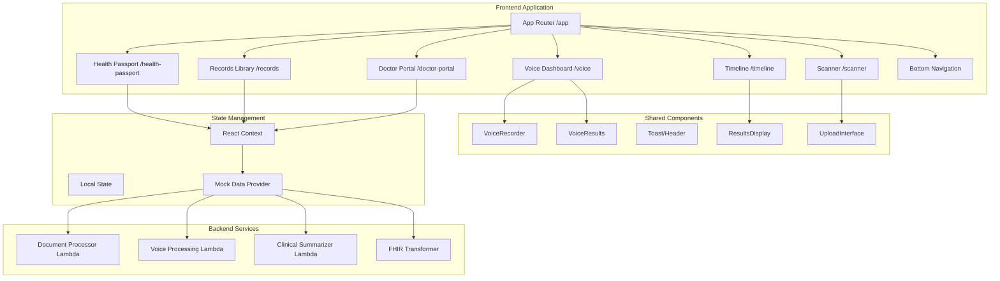

# Design Document: VaidyaLink Complete UI Flow

## Overview

The VaidyaLink Complete UI Flow implements a comprehensive healthcare platform interface with six core screens integrated into a cohesive mobile-first application. The design prioritizes rapid implementation by maximizing reuse of existing components from the document-scan-demo and features directories, using mock data initially for quick demonstration, and following established patterns for state management and API integration.

The system builds upon proven components (VoiceRecorder, VoiceResults, Toast, Header, ResultsDisplay) and extends them with new screens for health passport management, records library, doctor insights, and health timeline. The architecture supports both demo mode with mock data and production mode with real backend integration, allowing for incremental enhancement.

Key design principles:
- Component reuse over new development
- Mock data for rapid prototyping
- Progressive enhancement from demo to production
- Mobile-first responsive design
- Consistent patterns across all screens

## Architecture

### High-Level Architecture



### Routing Structure

The application uses Next.js App Router with the following route hierarchy:

```
/app
├── /vaidyalink
│   ├── layout.tsx              # Shared layout with bottom navigation
│   ├── /health-passport
│   │   └── page.tsx            # Health Passport Profile
│   ├── /records
│   │   └── page.tsx            # Records Library
│   ├── /doctor-portal
│   │   └── page.tsx            # Doctor's Insight View
│   ├── /voice
│   │   └── page.tsx            # Voice Dashboard (reuses existing)
│   ├── /scanner
│   │   └── page.tsx            # AI Document Scanner
│   └── /timeline
│       └── page.tsx            # Health Timeline & Export
```

### State Management Strategy

Given the time constraint and simplicity requirements, the design uses a hybrid approach:

1. **React Context for Global State**: Patient profile, current user role (patient/doctor), theme preference
2. **Local useState for Screen State**: Search queries, filters, form inputs, UI toggles
3. **Mock Data Provider**: Centralized mock data service that can be swapped for real API calls

This approach avoids the complexity of Redux/Zustand while maintaining clean separation of concerns.

### Component Reuse Strategy

**Existing Components to Reuse:**
- `VoiceRecorder` and `VoiceResults` from document-scan-demo (Requirements 4, 5)
- `Toast` and `ToastProvider` for notifications (all screens)
- `Header` component pattern for consistent headers
- `ResultsDisplay` for structured data display
- `UploadInterface` patterns for file handling
- `DemoModeToggle` for switching between mock and real data

**New Components to Create:**
- `BottomNavigation` - Mobile navigation bar (Requirement 7)
- `HealthPassportCard` - ABHA ID display (Requirement 1)
- `RecordCard` - Document thumbnail card (Requirement 2)
- `PatientSnapshot` - Condensed patient info (Requirement 3)
- `TrendChart` - Health metrics visualization (Requirement 3)
- `TimelineEvent` - Timeline item component (Requirement 6)

## Components and Interfaces

### Core Components

#### 1. VaidyaLinkLayout Component

Provides the shared layout with bottom navigation for all VaidyaLink screens.

```typescript
interface VaidyaLinkLayoutProps {
  children: React.ReactNode;
}

// Wraps all VaidyaLink pages with bottom navigation
// Manages theme state and user context
```

#### 2. BottomNavigation Component

Mobile navigation bar with icons for main sections.

```typescript
interface BottomNavigationProps {
  currentPath: string;
}

interface NavItem {
  id: string;
  label: string;
  icon: string;  // Material Symbols icon name
  path: string;
}

// Navigation items:
// - Health Passport (/vaidyalink/health-passport)
// - Records (/vaidyalink/records)
// - Voice (/vaidyalink/voice)
// - Doctor Portal (/vaidyalink/doctor-portal)
```

#### 3. HealthPassportCard Component

Displays ABHA ID with QR code and verification badge.

```typescript
interface HealthPassportCardProps {
  abhaId: string;
  qrCodeData: string;
  verified: boolean;
}

// Renders ABHA card with:
// - QR code generation
// - Verification badge
// - Copy to clipboard functionality
```

#### 4. RecordCard Component

Visual card for medical document display in records library.

```typescript
interface RecordCardProps {
  id: string;
  title: string;
  category: 'prescription' | 'lab-report' | 'scan' | 'other';
  date: string;
  thumbnailUrl?: string;
  verified: boolean;
  onClick: () => void;
}

// Displays:
// - Document thumbnail or category icon
// - Title and date
// - Verification badge
// - Category tag
```

#### 5. PatientSnapshot Component

Condensed patient information card for doctor's view.

```typescript
interface PatientSnapshotProps {
  patient: {
    name: string;
    age: number;
    gender: string;
    abhaId: string;
    photoUrl?: string;
    lastVisit: string;
  };
}

// Shows key demographics at a glance
```

#### 6. TrendChart Component

Health metrics visualization using simple SVG or Chart.js.

```typescript
interface TrendChartProps {
  metric: string;
  data: Array<{
    date: string;
    value: number;
  }>;
  unit: string;
  referenceRange?: {
    min: number;
    max: number;
  };
}

// Renders line chart with:
// - Time series data
// - Reference range shading
// - Hover tooltips
```

#### 7. TimelineEvent Component

Individual event in health timeline.

```typescript
interface TimelineEventProps {
  event: {
    id: string;
    type: 'visit' | 'lab' | 'prescription' | 'scan';
    date: string;
    title: string;
    description: string;
    structuredData?: object;
  };
  onExpand: () => void;
}

// Displays:
// - Event icon and type
// - Date and title
// - Expandable structured data
```

### Page Components

#### Health Passport Page

```typescript
// /app/vaidyalink/health-passport/page.tsx
interface HealthPassportPageState {
  privacyMode: boolean;
  patient: PatientProfile;
  authorizedDoctors: Doctor[];
}

interface PatientProfile {
  name: string;
  age: number;
  gender: string;
  abhaId: string;
  photoUrl: string;
  verified: boolean;
  allergies: string[];
  emergencyContacts: EmergencyContact[];
  bloodType: string;
  chronicConditions: string[];
}
```

#### Records Library Page

```typescript
// /app/vaidyalink/records/page.tsx
interface RecordsLibraryPageState {
  searchQuery: string;
  activeTab: 'all' | 'prescriptions' | 'lab-reports' | 'scans';
  dateFilter: 'latest' | 'all';
  records: MedicalRecord[];
  filteredRecords: MedicalRecord[];
}

interface MedicalRecord {
  id: string;
  title: string;
  category: string;
  date: string;
  thumbnailUrl?: string;
  verified: boolean;
  s3Key?: string;
}
```

#### Doctor Portal Page

```typescript
// /app/vaidyalink/doctor-portal/page.tsx
interface DoctorPortalPageState {
  patient: PatientProfile;
  clinicalSummary: ClinicalSummary;
  vitals: VitalSign[];
  medications: Medication[];
  trendData: TrendData[];
  magicMetric: {
    timeSaved: number;
    unit: string;
  };
}

interface ClinicalSummary {
  chiefComplaint: string;
  recentContext: string;
  criticalFlags: string[];
  generatedAt: string;
}
```

#### Voice Dashboard Page

```typescript
// /app/vaidyalink/voice/page.tsx
// Reuses existing VoiceRecorder and VoiceResults components
interface VoiceDashboardPageState {
  transcriptionResult: VoiceTranscriptionResult | null;
  healthSummary: {
    activePatients: number;
    criticalAlerts: number;
  };
  recentScans: Array<{
    id: string;
    thumbnailUrl: string;
    date: string;
  }>;
}
```

#### Scanner Page

```typescript
// /app/vaidyalink/scanner/page.tsx
interface ScannerPageState {
  cameraActive: boolean;
  scanning: boolean;
  detectedRegions: TextRegion[];
  capturedImage: string | null;
  structuredPreview: object | null;
}

interface TextRegion {
  x: number;
  y: number;
  width: number;
  height: number;
  confidence: number;
}
```

#### Timeline Page

```typescript
// /app/vaidyalink/timeline/page.tsx
interface TimelinePageState {
  events: TimelineEvent[];
  expandedEventId: string | null;
  exportInProgress: boolean;
}

interface TimelineEvent {
  id: string;
  type: 'visit' | 'lab' | 'prescription' | 'scan';
  date: string;
  title: string;
  description: string;
  structuredData?: object;
  fhirResource?: object;
}
```

## Data Models

### Patient Profile Model

```typescript
interface PatientProfile {
  id: string;
  abhaId: string;
  name: string;
  age: number;
  dateOfBirth: string;
  gender: 'male' | 'female' | 'other';
  photoUrl?: string;
  verified: boolean;

  // Critical Information
  bloodType: string;
  allergies: string[];
  chronicConditions: string[];
  emergencyContacts: EmergencyContact[];

  // Authorized Providers
  authorizedDoctors: Doctor[];

  // Metadata
  createdAt: string;
  updatedAt: string;
}

interface EmergencyContact {
  name: string;
  relationship: string;
  phone: string;
}

interface Doctor {
  id: string;
  name: string;
  specialization: string;
  hospital: string;
  photoUrl?: string;
}
```

### Medical Record Model

```typescript
interface MedicalRecord {
  id: string;
  patientId: string;
  title: string;
  category: 'prescription' | 'lab-report' | 'scan' | 'other';
  date: string;

  // Storage
  s3Key?: string;
  thumbnailUrl?: string;

  // Processing
  verified: boolean;
  processed: boolean;
  ocrText?: string;
  entities?: Entity[];

  // FHIR
  fhirResource?: object;

  // Metadata
  uploadedAt: string;
  processedAt?: string;
}
```

### Clinical Summary Model

```typescript
interface ClinicalSummary {
  patientId: string;
  generatedAt: string;

  // AI-Generated Content
  chiefComplaint: string;
  recentContext: string;
  criticalFlags: string[];

  // Supporting Data
  vitals: VitalSign[];
  medications: Medication[];
  recentLabs: LabResult[];

  // Metrics
  timeSavedMinutes: number;
  confidence: number;
}

interface VitalSign {
  type: 'blood-pressure' | 'heart-rate' | 'temperature' | 'oxygen-saturation';
  value: string;
  unit: string;
  timestamp: string;
  normal: boolean;
}

interface Medication {
  name: string;
  dosage: string;
  frequency: string;
  startDate: string;
  endDate?: string;
  active: boolean;
}
```

### Timeline Event Model

```typescript
interface TimelineEvent {
  id: string;
  patientId: string;
  type: 'visit' | 'lab' | 'prescription' | 'scan';
  date: string;

  // Display
  title: string;
  description: string;
  icon: string;

  // Data
  structuredData?: object;
  fhirResource?: object;

  // References
  recordId?: string;
  doctorId?: string;

  // Metadata
  createdAt: string;
}
```

### Mock Data Structure

```typescript
// /lib/vaidyalink/mock-data.ts
export const mockPatientProfile: PatientProfile = {
  id: 'patient-001',
  abhaId: '12-3456-7890-1234',
  name: 'Rajesh Kumar',
  age: 45,
  dateOfBirth: '1979-03-15',
  gender: 'male',
  photoUrl: '/mock-patient-photo.jpg',
  verified: true,
  bloodType: 'O+',
  allergies: ['Penicillin', 'Peanuts'],
  chronicConditions: ['Type 2 Diabetes', 'Hypertension'],
  emergencyContacts: [
    {
      name: 'Priya Kumar',
      relationship: 'Spouse',
      phone: '+91-98765-43210'
    }
  ],
  authorizedDoctors: [
    {
      id: 'doctor-001',
      name: 'Dr. Anjali Sharma',
      specialization: 'Endocrinology',
      hospital: 'Apollo Hospital',
      photoUrl: '/mock-doctor-1.jpg'
    },
    {
      id: 'doctor-002',
      name: 'Dr. Vikram Patel',
      specialization: 'Cardiology',
      hospital: 'Fortis Hospital',
      photoUrl: '/mock-doctor-2.jpg'
    }
  ],
  createdAt: '2023-01-15T10:00:00Z',
  updatedAt: '2024-01-20T15:30:00Z'
};

export const mockMedicalRecords: MedicalRecord[] = [
  {
    id: 'record-001',
    patientId: 'patient-001',
    title: 'Diabetes Follow-up Prescription',
    category: 'prescription',
    date: '2024-01-15',
    thumbnailUrl: '/sample-prescription.jpg',
    verified: true,
    processed: true,
    uploadedAt: '2024-01-15T09:00:00Z',
    processedAt: '2024-01-15T09:05:00Z'
  },
  {
    id: 'record-002',
    patientId: 'patient-001',
    title: 'HbA1c Test Results',
    category: 'lab-report',
    date: '2024-01-10',
    thumbnailUrl: '/mock-lab-report.jpg',
    verified: true,
    processed: true,
    uploadedAt: '2024-01-10T14:00:00Z',
    processedAt: '2024-01-10T14:03:00Z'
  }
];

export const mockClinicalSummary: ClinicalSummary = {
  patientId: 'patient-001',
  generatedAt: '2024-01-20T10:00:00Z',
  chiefComplaint: 'Routine diabetes follow-up, reports feeling fatigued',
  recentContext: 'Patient has been managing Type 2 Diabetes for 5 years. Recent HbA1c shows slight elevation to 7.2%. Blood pressure controlled on current medication.',
  criticalFlags: ['HbA1c elevated', 'Fatigue reported'],
  vitals: [
    {
      type: 'blood-pressure',
      value: '128/82',
      unit: 'mmHg',
      timestamp: '2024-01-20T09:45:00Z',
      normal: true
    },
    {
      type: 'heart-rate',
      value: '72',
      unit: 'bpm',
      timestamp: '2024-01-20T09:45:00Z',
      normal: true
    }
  ],
  medications: [
    {
      name: 'Metformin',
      dosage: '500mg',
      frequency: 'Twice daily',
      startDate: '2019-03-01',
      active: true
    },
    {
      name: 'Amlodipine',
      dosage: '5mg',
      frequency: 'Once daily',
      startDate: '2020-06-15',
      active: true
    }
  ],
  recentLabs: [],
  timeSavedMinutes: 15,
  confidence: 0.92
};

export const mockTimelineEvents: TimelineEvent[] = [
  {
    id: 'event-001',
    patientId: 'patient-001',
    type: 'visit',
    date: '2024-01-15',
    title: 'Endocrinology Consultation',
    description: 'Routine diabetes follow-up with Dr. Anjali Sharma',
    icon: 'medical_services',
    structuredData: {
      doctor: 'Dr. Anjali Sharma',
      duration: '30 minutes',
      notes: 'Patient reports good compliance with medication'
    },
    doctorId: 'doctor-001',
    createdAt: '2024-01-15T10:00:00Z'
  },
  {
    id: 'event-002',
    patientId: 'patient-001',
    type: 'lab',
    date: '2024-01-10',
    title: 'HbA1c Test',
    description: 'Glycated hemoglobin test for diabetes monitoring',
    icon: 'science',
    structuredData: {
      testName: 'HbA1c',
      value: '7.2',
      unit: '%',
      referenceRange: '4.0-5.6%'
    },
    recordId: 'record-002',
    createdAt: '2024-01-10T14:00:00Z'
  }
];
```


## Correctness Properties

A property is a characteristic or behavior that should hold true across all valid executions of a system-essentially, a formal statement about what the system should do. Properties serve as the bridge between human-readable specifications and machine-verifiable correctness guarantees.

### Property Reflection

After analyzing all acceptance criteria, I identified several areas of redundancy:

1. **List Rendering Properties**: Multiple criteria test that "for any list of X, all items should be rendered" (doctors, medications, vitals, scans, records). These can be consolidated into a single property about list rendering completeness.

2. **UI Presence Examples**: Many criteria simply check that specific UI elements exist (buttons, tabs, cards). These are better tested as unit test examples rather than properties.

3. **Navigation Properties**: Multiple criteria test that "clicking X should navigate to Y". These follow the same pattern and can be consolidated.

4. **Filtering Properties**: Search and tab filtering follow similar patterns and can be combined into a general filtering property.

5. **Round-Trip Properties**: Both document and FHIR parsers have explicit round-trip requirements (11.4, 12.4) which are the most important properties for those components.

After reflection, the following properties provide unique validation value:

### Property 1: Privacy Mode Hides Sensitive Data

*For any* patient profile with sensitive information (allergies, emergency contacts, ABHA ID), when privacy mode is enabled, all sensitive fields should be hidden or masked in the rendered output.

**Validates: Requirements 1.5**

### Property 2: Theme Persistence Round Trip

*For any* theme selection (light or dark), saving the theme to local storage and then loading it should result in the same theme being applied.

**Validates: Requirements 9.2**

### Property 3: List Rendering Completeness

*For any* list of items (doctors, medications, vitals, records, scans, timeline events), all items in the list should be rendered in the UI output.

**Validates: Requirements 1.4, 2.4, 3.5, 3.6, 4.5**

### Property 4: Search Filtering Correctness

*For any* search query and list of medical records, the filtered results should only contain records where the title, category, or date contains the search query (case-insensitive).

**Validates: Requirements 2.7**

### Property 5: Category Filtering Correctness

*For any* category selection (prescriptions, lab-reports, scans) and list of medical records, the filtered results should only contain records matching that category.

**Validates: Requirements 2.8**

### Property 6: Navigation Triggers Correct Route

*For any* navigation action (bottom nav click, record card click, action button click), the navigation should trigger a route change to the correct path.

**Validates: Requirements 2.6, 3.8, 7.4**

### Property 7: Timeline Chronological Ordering

*For any* list of timeline events with dates, the rendered timeline should display events in chronological order (most recent first or oldest first, consistently).

**Validates: Requirements 6.2**

### Property 8: FHIR Export Validity

*For any* timeline data with structured medical information, the exported FHIR JSON should be valid according to HL7 FHIR R4 schema validation.

**Validates: Requirements 6.5**

### Property 9: Touch Target Minimum Size

*For any* interactive UI element (buttons, links, cards), the rendered element should have minimum dimensions of 44px x 44px for touch accessibility.

**Validates: Requirements 8.3**

### Property 10: Medical Document Round Trip

*For any* valid MedicalDocument object, parsing it to text with the pretty printer and then parsing that text back should produce an equivalent MedicalDocument object.

**Validates: Requirements 11.4**

### Property 11: Document Parser Error Handling

*For any* invalid document input (malformed JSON, missing required fields, invalid data types), the document parser should return a descriptive error message rather than throwing an exception.

**Validates: Requirements 11.2**

### Property 12: Entity Extraction Completeness

*For any* medical document containing medications, diagnoses, vitals, or dates, the parser should extract all entities of each type present in the document.

**Validates: Requirements 11.5**

### Property 13: FHIR Resource Round Trip

*For any* valid FHIR resource (Patient, Observation, MedicationRequest, DiagnosticReport), parsing it to JSON with the pretty printer and then parsing that JSON back should produce an equivalent resource object.

**Validates: Requirements 12.4**

### Property 14: FHIR Parser Error Handling

*For any* invalid FHIR resource input (malformed JSON, missing required fields, invalid resource type), the FHIR parser should return validation errors rather than throwing an exception.

**Validates: Requirements 12.2**

### Property 15: FHIR Resource Type Support

*For any* FHIR resource of type Patient, Observation, MedicationRequest, or DiagnosticReport, the parser should successfully parse it into the correct typed object.

**Validates: Requirements 12.5**

### Property 16: AR Overlay Rendering

*For any* list of detected text regions with coordinates, the scanner should render an AR overlay for each region at the correct position.

**Validates: Requirements 5.2, 5.6**

### Property 17: Clinical Summary Component Completeness

*For any* clinical summary object with chief complaint, recent context, and critical flags, all three components should be rendered in the doctor's insight view.

**Validates: Requirements 3.3**

### Property 18: Timeline Event Details Display

*For any* timeline event with structured data, clicking the event should display the structured data in an expanded view.

**Validates: Requirements 6.3, 6.8**

### Property 19: Bottom Navigation Active State

*For any* current route path, the bottom navigation should highlight the navigation item corresponding to that route.

**Validates: Requirements 7.2**

### Property 20: Dark Mode Theme Application

*For any* UI component, when dark mode is enabled, the component should render with dark theme colors (dark backgrounds, light text).

**Validates: Requirements 1.8**

## Error Handling

### Frontend Error Handling Strategy

The application implements a layered error handling approach:

1. **API Client Layer**: Axios interceptors catch network errors, authentication failures, and server errors. Errors are enriched with user-friendly messages.

2. **Component Layer**: Try-catch blocks around async operations with fallback UI states. Toast notifications for user-facing errors.

3. **Parser Layer**: Validation errors return descriptive messages rather than throwing exceptions. Invalid input is handled gracefully.

4. **Demo Mode Fallback**: When backend services are unavailable, the app falls back to demo mode with mock data automatically.

### Error Categories

**Network Errors**:
- Connection timeout: Show retry button with exponential backoff
- 401 Unauthorized: Redirect to login (unless SKIP_AUTH is enabled)
- 429 Rate Limit: Show "too many requests" message with retry timer
- 500 Server Error: Show generic error with support contact

**Validation Errors**:
- Invalid file format: Show supported formats message
- Missing required fields: Highlight fields in form
- Invalid FHIR resource: Show validation errors with field names

**Processing Errors**:
- OCR failure: Offer manual entry option
- Entity extraction failure: Show raw OCR text as fallback
- FHIR transformation failure: Show structured data without FHIR export

**User Errors**:
- Empty search query: Show all records
- No records found: Show empty state with "add record" CTA
- Camera permission denied: Show permission instructions

### Error Recovery

**Automatic Recovery**:
- Retry failed API calls with exponential backoff (3 attempts)
- Fall back to demo mode if backend is unavailable
- Use cached data when offline (future enhancement)

**User-Initiated Recovery**:
- "Try Again" buttons for failed operations
- "Reset" buttons to clear error states
- "Contact Support" links for persistent errors

### Error Logging

**Client-Side Logging**:
- Console errors for development debugging
- Structured error objects with context
- User actions leading to errors

**Future Enhancements**:
- Send critical errors to monitoring service (Sentry, CloudWatch)
- Track error rates and patterns
- Alert on error spikes

## Testing Strategy

### Dual Testing Approach

The testing strategy employs both unit tests and property-based tests for comprehensive coverage:

**Unit Tests**: Verify specific examples, edge cases, and error conditions
- Specific UI rendering examples (buttons, cards, layouts)
- Edge cases (empty lists, null values, missing data)
- Error conditions (invalid input, network failures)
- Integration points between components

**Property Tests**: Verify universal properties across all inputs
- Round-trip properties for parsers (Properties 10, 13)
- List rendering completeness (Property 3)
- Filtering correctness (Properties 4, 5)
- Navigation behavior (Property 6)
- Error handling (Properties 11, 14)

Together, unit tests catch concrete bugs while property tests verify general correctness across the input space.

### Property-Based Testing Configuration

**Library Selection**:
- **JavaScript/TypeScript**: Use `fast-check` library (already in dependencies)
- **Python** (if backend parsers): Use `hypothesis` library

**Test Configuration**:
- Minimum 100 iterations per property test (due to randomization)
- Each property test must reference its design document property
- Tag format: `Feature: vaidyalink-complete-ui-flow, Property {number}: {property_text}`

**Example Property Test Structure**:

```typescript
// Property 10: Medical Document Round Trip
import fc from 'fast-check';
import { parseMedicalDocument, printMedicalDocument } from './document-parser';

describe('Feature: vaidyalink-complete-ui-flow, Property 10: Medical Document Round Trip', () => {
  it('should preserve document structure through parse-print-parse cycle', () => {
    fc.assert(
      fc.property(
        fc.record({
          id: fc.string(),
          patientId: fc.string(),
          title: fc.string(),
          category: fc.constantFrom('prescription', 'lab-report', 'scan', 'other'),
          date: fc.date().map(d => d.toISOString()),
          entities: fc.array(fc.record({
            text: fc.string(),
            type: fc.string(),
            confidence: fc.float({ min: 0, max: 1 })
          }))
        }),
        (originalDoc) => {
          // Parse to text
          const text = printMedicalDocument(originalDoc);

          // Parse back to object
          const parsedDoc = parseMedicalDocument(text);

          // Should be equivalent
          expect(parsedDoc).toEqual(originalDoc);
        }
      ),
      { numRuns: 100 }
    );
  });
});
```

### Unit Test Strategy

**Component Testing**:
- Render tests for each page component
- Interaction tests for buttons, forms, navigation
- State management tests for context providers
- Snapshot tests for UI consistency

**Utility Testing**:
- Parser tests with valid and invalid inputs
- Formatter tests with edge cases
- API client tests with mocked responses
- Mock data generator tests

**Integration Testing**:
- End-to-end flows (upload → process → display)
- Navigation flows between screens
- Authentication flows (login → access → logout)
- Demo mode vs production mode switching

### Test Coverage Goals

- **Unit Test Coverage**: 80% line coverage minimum
- **Property Test Coverage**: All 20 properties implemented
- **Integration Test Coverage**: All critical user flows
- **Accessibility Testing**: WCAG 2.1 AA compliance (manual + automated)

### Testing Tools

**Unit Testing**:
- Jest for test runner
- React Testing Library for component tests
- MSW (Mock Service Worker) for API mocking

**Property Testing**:
- fast-check for property-based tests
- Custom generators for domain objects

**E2E Testing**:
- Playwright for end-to-end tests (future enhancement)
- Visual regression testing (future enhancement)

**Accessibility Testing**:
- axe-core for automated a11y checks
- Manual testing with screen readers
- Keyboard navigation testing

### Test Organization

```
frontend/
├── __tests__/
│   ├── unit/
│   │   ├── components/
│   │   ├── lib/
│   │   └── utils/
│   ├── properties/
│   │   ├── document-parser.properties.test.ts
│   │   ├── fhir-parser.properties.test.ts
│   │   └── ui-components.properties.test.ts
│   └── integration/
│       ├── upload-flow.test.ts
│       └── navigation.test.ts
```

### Continuous Integration

**Pre-commit Hooks**:
- Run unit tests on changed files
- Run linter and type checker
- Format code with Prettier

**CI Pipeline**:
- Run all unit tests
- Run all property tests
- Check test coverage thresholds
- Run accessibility checks
- Build production bundle

**Deployment Gates**:
- All tests must pass
- Coverage must meet thresholds
- No critical accessibility violations
- Build must succeed
