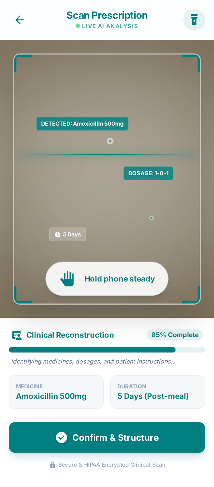
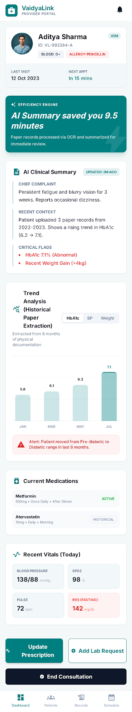
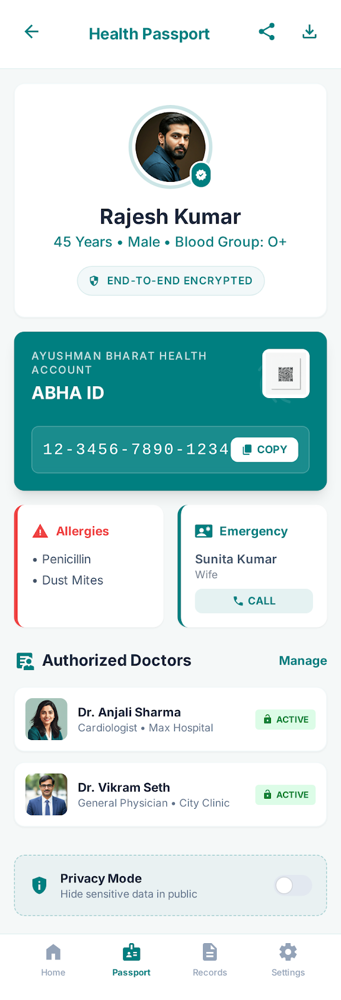
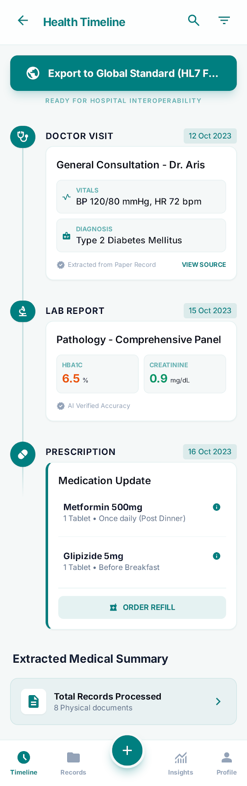
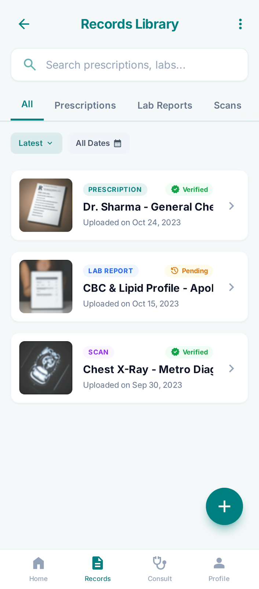
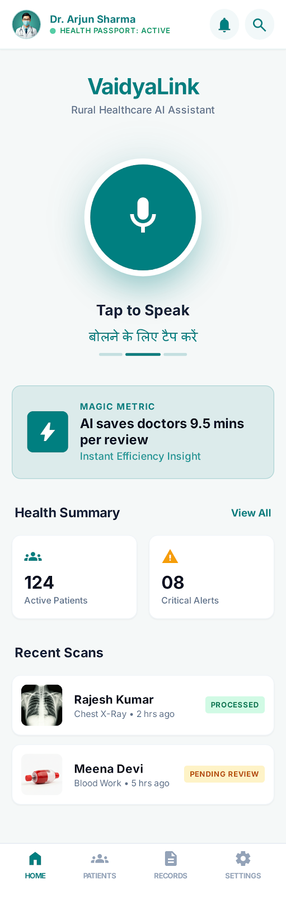

# VaidyaLink: Bridging the Paper-Gap in Bharat's Healthcare with Generative AI

> Transforming India's "Dark Data" into globally interoperable digital health records using AWS AI and serverless architecture.

[](https://aws.amazon.com)
[](https://abdm.gov.in)
[](https://www.hl7.org/fhir/)

---

## 🎯 Project Inspiration

India's healthcare system faces a critical challenge: **billions of medical records exist only on paper**, locked away in handwritten prescriptions, clinic files, and patient diaries. This "Dark Data" creates:

- **Fragmented Care**: Patients carry physical files between hospitals, losing critical history
- **Medical Tourism Barriers**: International providers cannot access Indian medical records
- **Rural Healthcare Gaps**: Non-literate patients struggle to communicate their health history
- **Emergency Delays**: Doctors waste precious minutes deciphering handwritten notes

**VaidyaLink** solves this by digitizing messy, handwritten Indian medical records into structured, globally interoperable HL7 FHIR data—compliant with the Ayushman Bharat Digital Mission (ABDM).

---

## 🚀 How It Works

### Step 1: 📸 Capture

Mobile-first scanning of physical prescriptions, lab reports, and handwritten notes using any smartphone camera.

### Step 2: 🤖 Process

Serverless AI pipeline powered by:

- **Amazon Bedrock (Claude 3.5 Sonnet)** for clinical reasoning and summarization
- **Bhashini API** for multilingual voice-to-text in 22 Indian languages
- **PaddleOCR** for handwritten medical text extraction

### Step 3: 🌐 Standardize

Automated conversion to:

- **HL7 FHIR R4** format for global interoperability
- **ABDM-compliant** records linked to ABHA ID
- **Consent Manager** integration for patient data control

---

## ✨ Key Features

### 🖋️ Vision-OCR: Deciphering Indian Medical Handwriting

High-accuracy extraction from handwritten prescriptions in multiple Indian languages and scripts (Devanagari, Tamil, Bengali, etc.)

### 🗣️ Multilingual Voice: Voice-Driven Health History for Bharat

Non-literate patients can speak their medical history in their native language—powered by Bhashini's speech-to-text API.

### 📋 Clinical Flash Dashboard: 30-Second Summaries

Doctors get AI-generated clinical summaries in under 30 seconds, reducing consultation time and improving care quality.

### 🌍 Global Passport: Portable Records for Medical Tourism

One-click export of complete medical history in HL7 FHIR format, enabling seamless care abroad.

### 🔒 Privacy-First Architecture

End-to-end encryption with AWS KMS, HIPAA-eligible infrastructure, and ABDM consent framework compliance.

### 💰 Cost-Efficient: Pay-Per-Scan Model

Serverless architecture ensures zero idle costs—approximately ₹0.40 per record processed.

---

## 📱 Working Prototype

**Scan the QR code below to try the live prototype:**

<p align="center">
  
</p>

### App Screenshots

<table>
  <tr>
    <td><br/><b>Live AI Scanning</b><br/>Real-time OCR extraction with confidence scores</td>
    <td><br/><b>Clinical Dashboard</b><br/>30-second AI summaries save 9.5 minutes per review</td>
    <td><br/><b>ABDM Integration</b><br/>ABHA ID linked health passport with encryption</td>
  </tr>
  <tr>
    <td><br/><b>FHIR Export</b><br/>One-click HL7 FHIR export for global interoperability</td>
    <td><br/><b>Records Management</b><br/>Organized library with verification status</td>
    <td><br/><b>Multilingual Voice</b><br/>22 Indian languages via Bhashini API</td>
  </tr>
</table>

---

## 🛠️ Technology Stack

| Layer          | Technology                         | Purpose                                               |
| -------------- | ---------------------------------- | ----------------------------------------------------- |
| **Frontend**   | Next.js 14 (App Router)            | Progressive Web App (PWA) for mobile-first experience |
|                | AWS Amplify                        | Hosting, CI/CD, and authentication                    |
| **Backend**    | AWS Lambda (Node.js/Python)        | Serverless compute for AI processing                  |
|                | Amazon API Gateway                 | RESTful API management                                |
| **AI Engine**  | Amazon Bedrock (Claude 3.5 Sonnet) | Clinical reasoning and summarization                  |
|                | Bhashini API                       | Multilingual speech-to-text (22 languages)            |
|                | PaddleOCR                          | Handwritten text extraction                           |
| **Storage**    | Amazon S3                          | Raw image storage with lifecycle policies             |
|                | AWS HealthLake                     | FHIR-compliant data store                             |
|                | Amazon DynamoDB                    | Metadata and user session management                  |
| **Security**   | AWS KMS                            | End-to-end encryption                                 |
|                | Amazon Cognito                     | User authentication and ABHA ID integration           |
| **Monitoring** | Amazon CloudWatch                  | Logging and performance metrics                       |
|                | AWS X-Ray                          | Distributed tracing                                   |

---

## 📦 Installation & Local Setup

### Project Structure

This is a monorepo containing all VaidyaLink components:

```
vaidyalink/
├── frontend/              # Next.js 14 web application
├── backend/               # AWS Lambda functions
│   ├── document-processing/    # OCR and extraction (Python)
│   ├── voice-processing/        # Voice transcription (Node.js)
│   ├── clinical-summarizer/     # Clinical summaries (Python)
│   ├── fhir-transformer/        # FHIR transformation (Python)
│   ├── abdm-connector/          # ABDM integration (Node.js)
│   ├── hitl-handler/            # Human verification (Node.js)
│   └── shared/                  # Shared utilities
├── infrastructure/        # AWS CDK infrastructure as code
└── docs/                  # Documentation and screenshots
```

### Prerequisites

- Node.js 18+
- pnpm 8+ (for monorepo management)
- AWS CLI configured
- Python 3.11+ (for Lambda development)

### Clone the Repository

```bash
git clone https://github.com/[your-username]/vaidyalink.git
cd vaidyalink
```

### Install Dependencies

```bash
# Install all workspace dependencies
pnpm install
```

### Development Commands

```bash
# Run frontend development server
pnpm dev

# Build all packages
pnpm build

# Run tests across all packages
pnpm test

# Lint all workspaces
pnpm lint

# Lint and fix all workspaces
pnpm lint:fix

# Format code
pnpm format

# Check code formatting
pnpm format:check
```

### Code Quality

VaidyaLink uses ESLint, Prettier, and Husky to maintain code quality across the monorepo. Pre-commit hooks automatically lint and format code before each commit.

For detailed information about code quality tools and configuration, see [CODE_QUALITY.md](CODE_QUALITY.md).

To verify your code quality setup:

```bash
# Windows
./scripts/verify-code-quality.ps1

# Linux/Mac
./scripts/verify-code-quality.sh
```

### Git Workflow

VaidyaLink follows a structured Git workflow with branch protection rules and commit conventions to ensure code quality and maintain audit trails for healthcare compliance.

**Quick Start**:

- [Git Quick Reference](docs/GIT_QUICK_REFERENCE.md) - Common commands and workflows
- [Full Git Workflow Guide](docs/GIT_WORKFLOW.md) - Complete branching strategy and conventions

**Key Points**:

- Use conventional commits: `feat(scope): description`
- Create feature branches from `develop`: `feature/task-number-description`
- All commits must pass linting and tests
- Pull requests require code review before merging

**Branch Protection Setup**:

```bash
# Set up branch protection rules (requires admin access)
# Linux/Mac
./scripts/setup-branch-protection.sh

# Windows
./scripts/setup-branch-protection.ps1
```

### Deployment

```bash
# Deploy to development environment
pnpm deploy:dev

# Deploy to staging environment
pnpm deploy:staging

# Deploy to production environment
pnpm deploy:prod
```

### Set Environment Variables

Create a `.env.local` file in the frontend directory:

```env
NEXT_PUBLIC_API_ENDPOINT=your-api-gateway-url
NEXT_PUBLIC_BHASHINI_API_KEY=your-bhashini-key
AWS_REGION=ap-south-1
```

### Run Development Server

```bash
pnpm dev
```

Visit `http://localhost:3000` to see the application.

---

## 🏗️ Architecture Overview

```
┌─────────────┐
│   Patient   │
│  (Mobile)   │
└──────┬──────┘
       │ Upload Image
       ▼
┌─────────────────┐
│  AWS Amplify    │
│  (Next.js PWA)  │
└────────┬────────┘
         │
         ▼
┌─────────────────┐
│  API Gateway    │
└────────┬────────┘
         │
         ▼
┌─────────────────┐      ┌──────────────┐
│  Lambda Trigger │─────▶│   S3 Bucket  │
│  (Orchestrator) │      │ (Raw Images) │
└────────┬────────┘      └──────────────┘
         │
         ▼
┌─────────────────────────────────┐
│     AI Processing Pipeline      │
│  ┌───────────────────────────┐  │
│  │ 1. PaddleOCR Extraction   │  │
│  │ 2. Bhashini Translation   │  │
│  │ 3. Bedrock Summarization  │  │
│  │ 4. FHIR Transformation    │  │
│  └───────────────────────────┘  │
└────────┬────────────────────────┘
         │
         ▼
┌─────────────────┐
│  AWS HealthLake │
│  (FHIR Store)   │
└────────┬────────┘
         │
         ▼
┌─────────────────┐
│ Patient Portal  │
│   & Dashboard   │
└─────────────────┘
```

---

## 🌟 Social Impact & Future Vision

### Reaching 1.4 Billion People

VaidyaLink is designed to scale across India's diverse healthcare landscape—from metro hospitals to rural primary health centers (PHCs).

### Digital Infrastructure for Smart Health Districts

Our vision extends beyond individual records:

- **Population Health Analytics**: Aggregate anonymized data for disease surveillance
- **Telemedicine Integration**: Enable remote consultations with complete patient history
- **Emergency Response**: Instant access to critical medical information during disasters

### Empowering the Next Billion Users

By supporting 22 Indian languages and voice interfaces, we ensure healthcare digitization reaches every citizen—regardless of literacy or technical skills.

---

## 🤝 Team & Recognition

**Project Lead**: Kunal Sharma
**Co-Founder**: [Name]

Built for the **AWS AI for Bharat Hackathon** with a mission to democratize healthcare access across India.

---

## 📄 License

This project is licensed under the MIT License - see the [LICENSE](LICENSE) file for details.

---

## 🙏 Acknowledgments

- **AWS** for providing the serverless infrastructure and AI capabilities
- **Bhashini** for enabling multilingual voice interfaces
- **ABDM** for establishing India's digital health standards
- **Open-source community** for tools like PaddleOCR and Next.js

---

## 📞 Contact & Support

For questions, feedback, or collaboration opportunities:

- **Email**: [contact@vaidyalink.in]
- **GitHub Issues**: [Report bugs or request features](https://github.com/[your-username]/vaidyalink/issues)
- **Twitter**: [@VaidyaLink]

---

<p align="center">
  <strong>Made with ❤️ for Bharat's Healthcare Revolution</strong>
</p>
