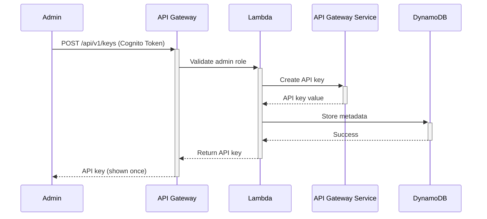
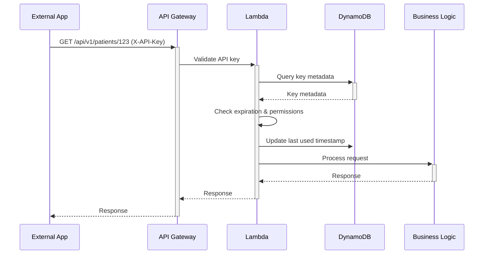

# API Key Integration Guide

Complete guide for integrating external systems with VaidyaLink using API keys.

## Table of Contents

1. [Architecture Overview](#architecture-overview)
2. [Authentication Flow](#authentication-flow)
3. [Integration Patterns](#integration-patterns)
4. [Code Examples](#code-examples)
5. [Testing](#testing)
6. [Production Deployment](#production-deployment)

## Architecture Overview

```
┌─────────────────┐
│  External App   │
└────────┬────────┘
         │ X-API-Key: vl_live_...
         ▼
┌─────────────────────────────────┐
│     API Gateway                 │
│  - API Key Validation           │
│  - Rate Limiting (by tier)      │
│  - Request Validation           │
└────────┬────────────────────────┘
         │
         ▼
┌─────────────────────────────────┐
│  Lambda Functions               │
│  - API Key Validator Middleware │
│  - Business Logic               │
└────────┬────────────────────────┘
         │
         ▼
┌─────────────────────────────────┐
│  DynamoDB                       │
│  - API Key Metadata             │
│  - Usage Tracking               │
└─────────────────────────────────┘
```

## Authentication Flow

### 1. API Key Creation (Admin Only)



### 2. API Request with API Key



## Integration Patterns

### Pattern 1: Direct API Integration

Best for: Simple integrations, single-service applications

```typescript
import axios from 'axios';

const vaidyalinkClient = axios.create({
  baseURL: 'https://api.vaidyalink.com/api/v1',
  headers: {
    'X-API-Key': process.env.VAIDYALINK_API_KEY,
    'Content-Type': 'application/json',
  },
  timeout: 30000,
});

// Get patient records
async function getPatientRecords(patientId: string) {
  try {
    const response = await vaidyalinkClient.get(`/patients/${patientId}/records`);
    return response.data;
  } catch (error) {
    if (error.response?.status === 429) {
      // Rate limit exceeded - implement exponential backoff
      console.error('Rate limit exceeded, retrying...');
      await sleep(60000);
      return getPatientRecords(patientId);
    }
    throw error;
  }
}
```

### Pattern 2: SDK Wrapper

Best for: Multiple services, reusable code

```typescript
// vaidyalink-sdk.ts
export class VaidyaLinkSDK {
  private apiKey: string;
  private baseURL: string;
  private retryAttempts: number = 3;

  constructor(apiKey: string, options?: { baseURL?: string; retryAttempts?: number }) {
    this.apiKey = apiKey;
    this.baseURL = options?.baseURL || 'https://api.vaidyalink.com/api/v1';
    this.retryAttempts = options?.retryAttempts || 3;
  }

  private async request<T>(
    method: string,
    path: string,
    data?: any,
    attempt: number = 1
  ): Promise<T> {
    try {
      const response = await fetch(`${this.baseURL}${path}`, {
        method,
        headers: {
          'X-API-Key': this.apiKey,
          'Content-Type': 'application/json',
        },
        body: data ? JSON.stringify(data) : undefined,
      });

      if (!response.ok) {
        if (response.status === 429 && attempt < this.retryAttempts) {
          // Exponential backoff
          const delay = Math.pow(2, attempt) * 1000;
          await new Promise((resolve) => setTimeout(resolve, delay));
          return this.request<T>(method, path, data, attempt + 1);
        }

        throw new Error(`API request failed: ${response.statusText}`);
      }

      return response.json();
    } catch (error) {
      if (attempt < this.retryAttempts) {
        const delay = Math.pow(2, attempt) * 1000;
        await new Promise((resolve) => setTimeout(resolve, delay));
        return this.request<T>(method, path, data, attempt + 1);
      }
      throw error;
    }
  }

  // Scans API
  async createScan(patientId: string, imageS3Key: string, metadata?: any) {
    return this.request('POST', '/scans', { patientId, imageS3Key, metadata });
  }

  async getScan(jobId: string) {
    return this.request('GET', `/scans/${jobId}`);
  }

  async getScanData(jobId: string) {
    return this.request('GET', `/scans/${jobId}/data`);
  }

  // Patients API
  async getPatientRecords(patientId: string, filters?: any) {
    const query = new URLSearchParams(filters).toString();
    return this.request('GET', `/patients/${patientId}/records?${query}`);
  }

  async getPatientSummary(patientId: string) {
    return this.request('GET', `/patients/${patientId}/summary`);
  }

  async exportPatientFHIR(patientId: string, format: 'json' | 'xml' = 'json') {
    return this.request('GET', `/patients/${patientId}/export?format=${format}`);
  }

  // ABDM API
  async linkABHA(abhaId: string, otp: string) {
    return this.request('POST', '/abdm/link', { abhaId, otp });
  }

  async fetchABDMRecords(abhaId: string, consentId?: string) {
    const query = consentId ? `?abhaId=${abhaId}&consentId=${consentId}` : `?abhaId=${abhaId}`;
    return this.request('GET', `/abdm/records${query}`);
  }
}

// Usage
const sdk = new VaidyaLinkSDK(process.env.VAIDYALINK_API_KEY!);

const records = await sdk.getPatientRecords('patient-123');
const summary = await sdk.getPatientSummary('patient-123');
```

### Pattern 3: Webhook Integration

Best for: Event-driven architectures, real-time updates

```typescript
// webhook-handler.ts
import express from 'express';
import crypto from 'crypto';

const app = express();
app.use(express.json());

// Verify webhook signature
function verifyWebhookSignature(payload: string, signature: string, secret: string): boolean {
  const expectedSignature = crypto.createHmac('sha256', secret).update(payload).digest('hex');
  return crypto.timingSafeEqual(Buffer.from(signature), Buffer.from(expectedSignature));
}

app.post('/webhooks/vaidyalink', (req, res) => {
  const signature = req.headers['x-vaidyalink-signature'] as string;
  const payload = JSON.stringify(req.body);

  if (!verifyWebhookSignature(payload, signature, process.env.WEBHOOK_SECRET!)) {
    return res.status(401).json({ error: 'Invalid signature' });
  }

  const event = req.body;

  switch (event.type) {
    case 'scan.completed':
      handleScanCompleted(event.data);
      break;
    case 'scan.failed':
      handleScanFailed(event.data);
      break;
    case 'hitl.required':
      handleHITLRequired(event.data);
      break;
    default:
      console.log('Unknown event type:', event.type);
  }

  res.json({ received: true });
});

async function handleScanCompleted(data: any) {
  console.log('Scan completed:', data.jobId);
  // Process completed scan
  const sdk = new VaidyaLinkSDK(process.env.VAIDYALINK_API_KEY!);
  const scanData = await sdk.getScanData(data.jobId);
  // Store in your database, trigger workflows, etc.
}
```

### Pattern 4: Batch Processing

Best for: Large-scale data processing, ETL pipelines

```typescript
// batch-processor.ts
import { VaidyaLinkSDK } from './vaidyalink-sdk';
import pLimit from 'p-limit';

class BatchProcessor {
  private sdk: VaidyaLinkSDK;
  private concurrency: number;

  constructor(apiKey: string, concurrency: number = 10) {
    this.sdk = new VaidyaLinkSDK(apiKey);
    this.concurrency = concurrency;
  }

  async processBatch(patientIds: string[]) {
    const limit = pLimit(this.concurrency);
    const results = [];

    const promises = patientIds.map((patientId) =>
      limit(async () => {
        try {
          const records = await this.sdk.getPatientRecords(patientId);
          const summary = await this.sdk.getPatientSummary(patientId);
          return { patientId, records, summary, status: 'success' };
        } catch (error) {
          console.error(`Failed to process patient ${patientId}:`, error);
          return { patientId, status: 'failed', error: error.message };
        }
      })
    );

    return Promise.all(promises);
  }
}

// Usage
const processor = new BatchProcessor(process.env.VAIDYALINK_API_KEY!, 10);
const patientIds = ['patient-1', 'patient-2', 'patient-3' /* ... */];
const results = await processor.processBatch(patientIds);

console.log(
  `Processed ${results.filter((r) => r.status === 'success').length} patients successfully`
);
```

## Code Examples

### Node.js / TypeScript

```typescript
import axios from 'axios';

const API_KEY = process.env.VAIDYALINK_API_KEY;
const BASE_URL = 'https://api.vaidyalink.com/api/v1';

// Create scan
async function createScan(patientId: string, imageS3Key: string) {
  const response = await axios.post(
    `${BASE_URL}/scans`,
    {
      patientId,
      imageS3Key,
      metadata: {
        documentType: 'prescription',
        captureDate: new Date().toISOString(),
      },
    },
    {
      headers: {
        'X-API-Key': API_KEY,
        'Content-Type': 'application/json',
      },
    }
  );

  return response.data;
}

// Poll for scan completion
async function waitForScanCompletion(jobId: string, maxAttempts: number = 30) {
  for (let i = 0; i < maxAttempts; i++) {
    const response = await axios.get(`${BASE_URL}/scans/${jobId}`, {
      headers: { 'X-API-Key': API_KEY },
    });

    if (response.data.status === 'completed') {
      return response.data;
    }

    if (response.data.status === 'failed') {
      throw new Error('Scan processing failed');
    }

    await new Promise((resolve) => setTimeout(resolve, 2000));
  }

  throw new Error('Scan processing timeout');
}
```

### Python

```python
import os
import time
import requests
from typing import Dict, Any

API_KEY = os.environ['VAIDYALINK_API_KEY']
BASE_URL = 'https://api.vaidyalink.com/api/v1'

class VaidyaLinkClient:
    def __init__(self, api_key: str):
        self.api_key = api_key
        self.session = requests.Session()
        self.session.headers.update({
            'X-API-Key': api_key,
            'Content-Type': 'application/json'
        })

    def create_scan(self, patient_id: str, image_s3_key: str, metadata: Dict[str, Any] = None) -> Dict:
        response = self.session.post(
            f'{BASE_URL}/scans',
            json={
                'patientId': patient_id,
                'imageS3Key': image_s3_key,
                'metadata': metadata or {}
            }
        )
        response.raise_for_status()
        return response.json()

    def get_scan(self, job_id: str) -> Dict:
        response = self.session.get(f'{BASE_URL}/scans/{job_id}')
        response.raise_for_status()
        return response.json()

    def wait_for_scan_completion(self, job_id: str, max_attempts: int = 30) -> Dict:
        for _ in range(max_attempts):
            scan = self.get_scan(job_id)

            if scan['status'] == 'completed':
                return scan

            if scan['status'] == 'failed':
                raise Exception('Scan processing failed')

            time.sleep(2)

        raise Exception('Scan processing timeout')

    def get_patient_records(self, patient_id: str, **filters) -> Dict:
        response = self.session.get(
            f'{BASE_URL}/patients/{patient_id}/records',
            params=filters
        )
        response.raise_for_status()
        return response.json()

# Usage
client = VaidyaLinkClient(API_KEY)
scan = client.create_scan('patient-123', 's3://bucket/image.jpg')
result = client.wait_for_scan_completion(scan['jobId'])
print(f"Scan completed: {result}")
```

### Java

```java
import java.net.http.HttpClient;
import java.net.http.HttpRequest;
import java.net.http.HttpResponse;
import java.net.URI;
import com.google.gson.Gson;

public class VaidyaLinkClient {
    private final String apiKey;
    private final String baseUrl;
    private final HttpClient httpClient;
    private final Gson gson;

    public VaidyaLinkClient(String apiKey) {
        this.apiKey = apiKey;
        this.baseUrl = "https://api.vaidyalink.com/api/v1";
        this.httpClient = HttpClient.newHttpClient();
        this.gson = new Gson();
    }

    public ScanResponse createScan(String patientId, String imageS3Key) throws Exception {
        var requestBody = new CreateScanRequest(patientId, imageS3Key);
        var json = gson.toJson(requestBody);

        var request = HttpRequest.newBuilder()
            .uri(URI.create(baseUrl + "/scans"))
            .header("X-API-Key", apiKey)
            .header("Content-Type", "application/json")
            .POST(HttpRequest.BodyPublishers.ofString(json))
            .build();

        var response = httpClient.send(request, HttpResponse.BodyHandlers.ofString());

        if (response.statusCode() != 201) {
            throw new Exception("Failed to create scan: " + response.body());
        }

        return gson.fromJson(response.body(), ScanResponse.class);
    }

    public ScanStatus getScan(String jobId) throws Exception {
        var request = HttpRequest.newBuilder()
            .uri(URI.create(baseUrl + "/scans/" + jobId))
            .header("X-API-Key", apiKey)
            .GET()
            .build();

        var response = httpClient.send(request, HttpResponse.BodyHandlers.ofString());
        return gson.fromJson(response.body(), ScanStatus.class);
    }
}
```

## Testing

### Unit Tests

```typescript
import { VaidyaLinkSDK } from './vaidyalink-sdk';
import nock from 'nock';

describe('VaidyaLinkSDK', () => {
  const apiKey = 'test-api-key';
  const baseURL = 'https://api.vaidyalink.com/api/v1';
  let sdk: VaidyaLinkSDK;

  beforeEach(() => {
    sdk = new VaidyaLinkSDK(apiKey, { baseURL });
  });

  afterEach(() => {
    nock.cleanAll();
  });

  test('creates scan successfully', async () => {
    nock(baseURL).post('/scans').reply(201, {
      jobId: 'job-123',
      status: 'pending',
    });

    const result = await sdk.createScan('patient-123', 's3://bucket/image.jpg');
    expect(result.jobId).toBe('job-123');
  });

  test('retries on rate limit', async () => {
    nock(baseURL)
      .get('/scans/job-123')
      .reply(429, { message: 'Rate limit exceeded' })
      .get('/scans/job-123')
      .reply(200, { jobId: 'job-123', status: 'completed' });

    const result = await sdk.getScan('job-123');
    expect(result.status).toBe('completed');
  });
});
```

### Integration Tests

```typescript
describe('VaidyaLink Integration', () => {
  const sdk = new VaidyaLinkSDK(process.env.TEST_API_KEY!);

  test('end-to-end scan workflow', async () => {
    // Create scan
    const scan = await sdk.createScan('test-patient', 's3://test-bucket/test-image.jpg');
    expect(scan.jobId).toBeDefined();

    // Wait for completion
    let status;
    for (let i = 0; i < 30; i++) {
      status = await sdk.getScan(scan.jobId);
      if (status.status === 'completed') break;
      await new Promise((resolve) => setTimeout(resolve, 2000));
    }

    expect(status.status).toBe('completed');

    // Get extracted data
    const data = await sdk.getScanData(scan.jobId);
    expect(data).toBeDefined();
  });
});
```

## Production Deployment

### Environment Variables

```bash
# .env.production
VAIDYALINK_API_KEY=vl_live_...
VAIDYALINK_BASE_URL=https://api.vaidyalink.com/api/v1
VAIDYALINK_TIMEOUT=30000
VAIDYALINK_RETRY_ATTEMPTS=3
```

### Docker Deployment

```dockerfile
FROM node:18-alpine

WORKDIR /app

COPY package*.json ./
RUN npm ci --only=production

COPY . .

ENV NODE_ENV=production

CMD ["node", "dist/index.js"]
```

### Kubernetes Deployment

```yaml
apiVersion: apps/v1
kind: Deployment
metadata:
  name: vaidyalink-integration
spec:
  replicas: 3
  selector:
    matchLabels:
      app: vaidyalink-integration
  template:
    metadata:
      labels:
        app: vaidyalink-integration
    spec:
      containers:
        - name: app
          image: your-registry/vaidyalink-integration:latest
          env:
            - name: VAIDYALINK_API_KEY
              valueFrom:
                secretKeyRef:
                  name: vaidyalink-secrets
                  key: api-key
          resources:
            requests:
              memory: '256Mi'
              cpu: '250m'
            limits:
              memory: '512Mi'
              cpu: '500m'
```

## Monitoring

### CloudWatch Metrics

Monitor these key metrics:

- `ApiKeyValidationSuccess` - Successful API key validations
- `ApiKeyValidationFailed` - Failed validations (by reason)
- `ApiKeyCreated` - New API keys created
- `ApiKeyRevoked` - API keys revoked
- `ApiKeyRotated` - API keys rotated

### Application Monitoring

```typescript
import { CloudWatch } from '@aws-sdk/client-cloudwatch';

const cloudwatch = new CloudWatch({});

async function trackAPICall(endpoint: string, duration: number, success: boolean) {
  await cloudwatch.putMetricData({
    Namespace: 'VaidyaLink/Integration',
    MetricData: [
      {
        MetricName: 'APICallDuration',
        Value: duration,
        Unit: 'Milliseconds',
        Dimensions: [
          { Name: 'Endpoint', Value: endpoint },
          { Name: 'Success', Value: success.toString() },
        ],
      },
    ],
  });
}
```

## Support

For integration support:

- Email: integrations@vaidyalink.com
- Slack: #vaidyalink-integrations
- Documentation: https://docs.vaidyalink.com
